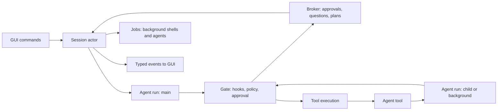

# v2 engine architecture

Status: implemented (v2.0). The crate layout and
dependency rules are in [AGENTS.md](../../AGENTS.md#crates); phase progress
is in [status](../status.md).

The model supplies judgment; the engine supplies authority, execution,
evidence and durability. Every executable capability (tools, MCP, hooks,
checks) goes through one gate, and every observable change is an event.

## Runtime model



- **Engine** (process-wide): paths, session store, model catalog, web client,
  a `ClientFactory` (tests inject a scripted model), and an event sink
  (`Arc<dyn Fn(EventEnvelope)>`) shared by every session.
- **Session**: `SessionCore` is shared state behind short-lived locks
  (settings, policy, transcript state, session log, broker, jobs, tools).
  The **session actor** task owns the command channel and never blocks on
  the model or a tool: turns run in their own tasks and report back through
  an internal channel. Approvals, questions and plan reviews wait on the
  broker, so steering, mode changes and cancel keep working meanwhile.
- **Agent run**: one loop per agent (main or subagent), parameterized by an
  agent definition (prompt, tool filter, model, permission mode), a
  transcript sink (main: session log and state; subagent: its own
  `agents/<id>.jsonl`), a root directory (project or worktree), a depth,
  and a cancellation token.

Cancellation is a tree: session > turn > agent run > tool call. `Cancel`
and `Interrupt` cancel the foreground turn and its foreground subagents;
background jobs have tokens under the session and survive.

## One round of an agent run

1. Check cancellation, the per-run turn budget (`agents.max_turns`) and the
   session cost cap.
2. Relieve context pressure: above 50% of the window, clear old tool results
   (spilling originals to artifacts); above `context.compact_at_percent`,
   summarize older history with the `fast` model (`PreCompact` hook first).
3. Build the request: cache-stable system sections (base prompt,
   environment, instructions, skills, output style), filtered tool specs,
   the working transcript, cache breakpoints on the last two user messages,
   thinking/effort, and pending reminders appended to the last user message.
4. Stream the response: text/thinking deltas become events; `Retrying`
   becomes a `retrying` event; a context-overflow error forces compaction
   and one retry.
5. Record the assistant message and usage (per-agent and session cost from
   the catalog).
6. No tool calls: run the **stop boundary** (below). Otherwise execute the
   batch and append one user message holding every tool result (in call
   order), queued steering messages, and reminders (todo nudges, files
   changed externally, finished jobs, nested instructions).

Every `tool_use` always receives a `tool_result`, including on cancellation
("cancelled by user"), so a transcript is valid for any provider on resume.

### Tool batch

For each call, in order:

1. Unknown tool, malformed JSON or invalid input -> error result.
2. `PreToolUse` hooks (regex matcher on the tool name) may block, rewrite
   the input, or force allow/deny/ask.
3. `tool.action(input)` -> `policy.decide(tool, action, mode)`:
   `Allow` runs; `Deny` returns the reason; `Ask` becomes an approval
   request. All asks in a batch are requested together; the GUI may answer
   them in any order. `AllowSession` adds a session rule; `AllowProject`
   also persists the rule to `.z-engine/settings.local.toml`; `Deny` returns
   the user's feedback to the model.

Execution keeps call order: neighbouring calls that are concurrency-safe
run together; any other call is a barrier and runs alone. Each call emits
`toolStarted`, streamed `toolProgress`, and `toolFinished`, then runs
`PostToolUse` hooks (extra context or feedback is appended to the result).
Writes mark the run as mutated, refresh read tracking, and queue nested
`AGENTS.md`/rules reminders for newly touched directories.

### Stop boundary

When the model ends a response without tool calls:

1. `Stop` (main) or `SubagentStop` hooks may block with a reason; the run
   continues with that reason (at most 5 hook continuations per turn).
2. Steering messages that arrived meanwhile continue the run.
3. Main agent only, when files changed this turn: `verification.mode`
   `auto` runs the configured checks and feeds failures back; `strict`
   additionally continues until checks pass. Both are bounded by
   `verification.max_continuations`; `report` only computes the badge.
4. Otherwise the run ends. The turn records its outcome, usage, cost and
   verification badge (`Verified` / `Unverified` / `Failed` /
   `NotApplicable`).

## Tools contract (`z-engine-tools`)

```rust
#[async_trait]
pub trait Tool: Send + Sync {
    fn name(&self) -> &str;
    fn description(&self) -> String;        // from z-engine-prompts::tools
    fn input_schema(&self) -> Value;
    fn is_read_only(&self, input: &Value) -> bool;
    fn is_concurrency_safe(&self, input: &Value) -> bool;
    fn action(&self, input: &Value, ctx: &ToolCtx) -> Action;       // z_engine_policy::Action
    fn title(&self, input: &Value, ctx: &ToolCtx) -> String;        // "Edit src/main.rs"
    async fn preview(&self, input: &Value, ctx: &ToolCtx) -> Option<Preview>;
    async fn call(&self, input: Value, ctx: &ToolCtx) -> Result<ToolOutput, ToolError>;
}
```

`ToolCtx` is the per-call capability bundle: session/agent/call ids, root
directory and additional directories, the agent's persistent shell cwd,
a cancellation token, the agent's `FileTracker` (read-before-edit), shared
`PathLocks`, shell and environment policy, web client and options, a
progress sink, an artifact spill function, limits, whether the model has
vision, and `Ports`: engine services behind traits so tools never depend on
the engine:

- `AgentPort`: agent catalog, spawn (foreground/background/resume), apply a
  worktree agent's changes.
- `InteractionPort`: ask structured questions, propose a plan, update todos.
- `JobPort`: spawn a background shell, read job output, kill a job.
- `SkillPort`, `CheckPort` (list/run checks with evidence), `LspPort`,
  `McpPort` (call tools, list/read resources), `SideModelPort` (WebFetch
  extraction with the `fast` model).

## Subagents and jobs

- Definitions: built-ins (`general`, `explore`, `plan`, `review`, `verify`)
  shipped as markdown in `z-engine-prompts`, plus custom definitions from
  `.z-engine/agents` and `.claude/agents`. Tools are filtered by the
  definition; `AskUserQuestion` and `ExitPlanMode` are never given to
  subagents; `Agent` is removed at the depth limit.
- A subagent's permission mode is its definition's mode, else the parent's.
  Its approvals appear in the GUI labelled with its agent id.
- Foreground agents return their final message (plus usage and changed
  files) as the `Agent` tool result. Background agents return a job id at
  once; completion queues a reminder for the parent. `resume` continues a
  finished agent from its stored transcript.
- `isolation: worktree` runs the agent in `.z-engine/worktrees/<agent>` on a
  new branch. At the end its changes are committed and summarized; the
  parent (`ApplyAgentChanges`) or the user (GUI) applies them with a
  three-way merge or discards them.
- Jobs unify background shells and background agents: `JobOutput` reads
  new output, `JobKill` stops, `jobUpdated` events feed the jobs panel.

## Persistence

`z-engine-store` keeps one directory per session: `log.jsonl` (records:
messages, turns, todos, plans, questions, approvals, agents, checks,
checkpoints, compactions, rewinds, mode/model/title changes, usage),
`meta.json`, `agents/<id>.jsonl`, and `artifacts/`. Replay rebuilds the
display transcript and the model's working set; a turn that started but
never finished is reported as `Interrupted`. v1 files are imported on
first open and left untouched.

Before each user turn the engine snapshots the working tree into a shadow
git repository (outside the project; captures shell-made changes). Rewind
restores code, conversation, or both to the state before any user message.

## Settings files

v2 reads `settings.toml` files and never modifies v1 `config.toml` files,
so a v1 build keeps working side by side. Layers, lowest first: defaults,
`~/.config/z-engine/settings.toml`, `<project>/.z-engine/settings.toml`,
`<project>/.z-engine/settings.local.toml` (gitignored), then environment
overrides. When a v2 file is missing, the v1 `config.toml` at that level is
imported: the user file is converted once into `settings.toml`; project
files are converted in memory and written to `settings.toml` only on the
first change made through the app.

## Hooks

Configured in settings (`[[hooks.<Event>]] matcher, command, timeout_secs`).
The command receives JSON on stdin (`session_id`, `transcript_path`, `cwd`,
`hook_event_name`, and event fields such as `tool_name`, `tool_input`,
`tool_response`, `prompt`, `stop_hook_active`). Exit 0 continues (stdout
becomes context for `UserPromptSubmit`/`SessionStart`); exit 2 blocks with
stderr as the reason; other codes warn. JSON stdout may set `decision`
(`block`/`approve`), `reason`, `continue: false` with `stopReason`, and
`hookSpecificOutput` (`permissionDecision`, `permissionDecisionReason`,
`updatedInput`, `additionalContext`). Project-defined hooks, MCP servers
and checks run only after the user trusts the workspace. Opening a session
of an untrusted project that defines any of them emits `trustRequired`;
`trustWorkspace { trusted: true }` records the root in `trust.json` and
reloads the session (`false` only dismisses the request).

## Commands

`runCommand { name, args }` resolves against one catalog (`engine/src/
commands/`), first name wins: engine built-ins (`compact`, `context`,
`cost`, `status`, `remember`, `model`, `mode`, `effort`, `mcp`, `todos`,
`doctor`, `add-dir`), custom commands (discovery already layers project >
`.claude` project > user > `.claude` user; they may shadow a prompt built-in
but never an engine built-in), prompt built-ins
(`z_engine_prompts::commands::BUILTIN`), and MCP prompts of ready servers as
`mcp__<server>__<prompt>`. The GUI's own commands (`help`, `agents`, ...)
are listed by `Engine::slash_commands` with kind `ui` and never resolved.

- Engine built-ins answer without the model; informational ones emit
  `commandOutput { name, markdown }`. `/add-dir` extends the session policy
  (with `--save` also `permissions.additional_directories` in
  `settings.local.toml`).
- Prompt commands start a turn whose user message has two text blocks: the
  visible `/name args`, then the body in `<command name="name">…</command>`.
  Templates substitute `$ARGUMENTS` and `$1`..`$9` (shell-style words),
  inline `@path` files the policy lets the model read (256 KiB per file,
  1 MiB total), and run `` !`cmd` `` in the project root only when the
  command's `allowed-tools` or the session policy allow it. `allowed-tools`
  become session rules for that turn only; `model` overrides the model for
  that turn only. MCP prompt arguments map positionally or as `key=value`;
  missing required ones produce a notice instead of a turn.
- `@agent-<name>` of a known agent type adds a reminder to use the `Agent`
  tool with that `subagent_type`. Unknown commands get a notice with close
  matches.

## Context and memory

- **Instructions:** `~/.config/z-engine/AGENTS.md`, `AGENTS.md`/`CLAUDE.md`
  from the repository root down to the project, and `AGENTS.local.md` form
  the instructions section of the system prompt (later files take
  precedence). `AGENTS.md` files in subdirectories and glob-scoped rules
  (`.z-engine/rules/*.md` with `globs`) are injected as reminders the first
  time the agent touches a matching path; `alwaysApply` rules stay in the
  system prompt.
- **Prompt caching:** system sections are ordered for a stable prefix (base
  prompt, environment, instructions, skills, output style, repo map); the
  last cacheable section, the tool list and the last two user messages carry
  cache breakpoints (native on Anthropic, passthrough on OpenRouter).
- **Repo map:** a tree-sitter outline of Rust, TypeScript/JavaScript, Python
  and Go definitions, ranked by cross-file references and the files touched
  in the session, built off the request path and rebuilt only after a
  compaction or reload so the cached prefix stays stable.
- **Compaction:** above half the context window, old tool results are cleared
  (originals spilled to artifacts); above `context.compact_at_percent`,
  older history is summarized by the `fast` model. A split never separates a
  tool call from its result and may land inside a long single turn.

## MCP and language servers

Each session starts its MCP servers in the background from the effective
settings (project-defined servers only in trusted workspaces). Tools are
registered as `mcp__<server>__<tool>` through the shared gate; a
`tools/list_changed` notification refreshes them. Above 40 MCP tools the
schemas are deferred: a reminder lists the tools and `LoadMcpTools` adds the
named schemas from the next request on. MCP prompts become slash commands.

Language servers start lazily per file type when their binary is installed
(rust-analyzer, typescript-language-server, pyright/basedpyright, gopls,
clangd, or configured ones). The `LSP` tool answers navigation, symbol,
diagnostics and rename-preview queries; after a write to a covered file,
error diagnostics are appended to that tool result when the server has
fresh ones.

## Verification

Checks are discovered per session (Cargo, npm/pnpm/yarn/bun, Python, Go,
Gradle, Maven, .NET, CMake, Make, just, Deno) plus configured
`[[verification.checks]]`; discovery never executes anything. `Verify`
lists and runs them through the normal gate and records a `CheckRecord`
(command, exit code, parsed test counts, duration, output artifact, workspace
fingerprints before and after). A turn that changed files ends `Verified`
only when a passing test, build or typecheck record is newer than the last
change and its fingerprint matches the current tree; a failing latest check
gives `Failed`; otherwise `Unverified` with the reason. `verification.mode`:
`off`, `report` (badge only), `auto` (run the configured checks at the stop
boundary in trusted workspaces and feed failures back), `strict` (keep going
until verified or `max_continuations` is spent). Nothing blocks the user.

## Sandbox

`[shell.sandbox]` (off by default) runs agent shell commands, background
shells and checks under macOS seatbelt (`sandbox-exec`) or Linux bubblewrap.
Writes are allowed only in the agent's root (a worktree agent gets its
worktree, not the main project), additional directories, temp directories
and known tool caches; `.git/hooks`, `.git/config` and harness settings files
stay read-only so a command cannot plant code that runs outside the sandbox.
`allow_network = false` blocks outbound traffic except localhost (macOS).
With `auto_allow`, the policy allows sandboxed commands whose writes stay in
bounds without asking; deny rules, ask rules and plan mode still win. When
no backend exists, commands run unconfined, keep asking, and a warning says
why.
