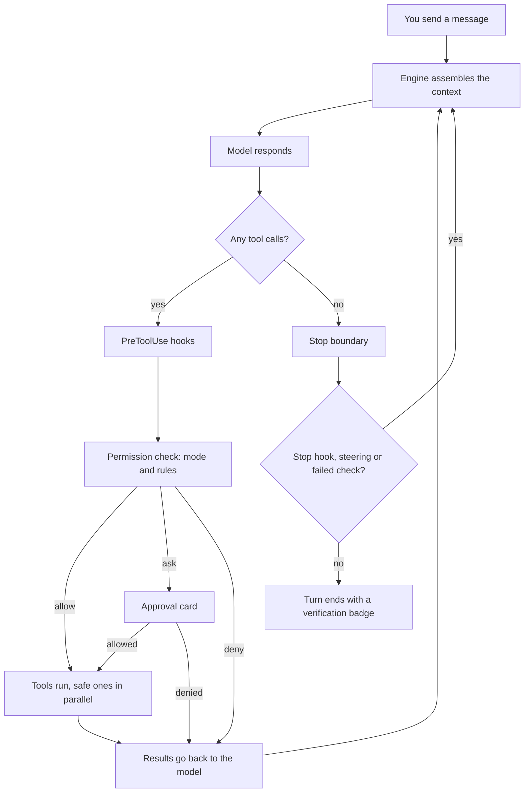

# How Z Engine works

These pages explain Z Engine 2.0 for everyone: people who just use the app,
people who are curious about what happens behind the screen, and people who
want to change the code. Every section starts in plain words and goes
deeper step by step, so you can stop reading as soon as you know enough.
[How to read these pages](#how-to-read-these-pages) explains the layout,
and the [contents](#contents) list every page.

To learn how to *use* the app, read the [user guide](../user-guide/README.md)
instead. The engine's formal runtime contract is
[v2 engine architecture](../architecture/v2-engine.md).

## What an AI coding agent is

**In plain words**

An AI coding agent is a chat assistant that can *do* things, not only talk.
Think of a capable new colleague sitting at your computer: they read your
code, run commands and edit files, but they ask before touching anything
important and tell you what they did.

**How it works**

1. A [model](glossary.md#model) is a program that reads text and writes
   text. On its own it cannot open a file or run a command.
2. The app tells the model which [tools](glossary.md#tool) exist ("read a
   file", "search", "run a shell command", "edit a file"), each with a name
   and a description of its input.
3. When the model wants to act, its reply contains a
   [tool call](glossary.md#tool-call): "run `Read` on `src/auth.ts`".
4. The app runs the tool and sends the output back as a
   [tool result](glossary.md#tool-result).
5. The model reads the result and decides the next step. This repeats until
   the model answers without asking for a tool.

That repeating cycle is called the agent loop. Almost everything else in
Z Engine exists to make the loop safe, fast, and trustworthy.

**For developers**

- The loop is `AgentRun` in
  [run/agent.rs](../../crates/z-engine-engine/src/run/agent.rs): rounds of
  request, stream, record, then either a tool batch or the stop boundary.
- The engine reaches a model only through the `ModelClient` trait in
  [client.rs](../../crates/z-engine-llm/src/client.rs), with adapters for
  OpenAI-compatible chat and Anthropic messages in the same crate.
- Tools implement the `Tool` trait in
  [tool.rs](../../crates/z-engine-tools/src/tool.rs); the 22 built-in names
  are listed in [names.rs](../../crates/z-engine-tools/src/names.rs).

## The core idea: judgment versus authority

**In plain words**

The model supplies judgment; the engine supplies authority, execution,
evidence and durability. Picture an expert giving instructions over the
phone (the model) and a site manager who holds the keys, does the work,
keeps the receipts and writes everything in the logbook (the engine).

**How it works**

The engine takes on four jobs the model is never trusted with:

- **Authority: who may do what.** Every tool call, [hook](glossary.md#hook),
  [MCP](glossary.md#mcp) tool and [check](glossary.md#check) goes through
  one permission gate. The gate decides *allow*, *ask* or *deny* from your
  [permission mode](glossary.md#permission-mode) and
  [rules](glossary.md#rule). An *ask* becomes an
  [approval](glossary.md#approval) card. The model cannot skip the gate.
- **Execution: the engine does the work.** The engine, not the model, reads
  files, runs commands and fetches web pages. It runs safe calls in
  parallel, cancels work when you press stop, and can confine commands in a
  [sandbox](glossary.md#sandbox).
- **Evidence: facts, not claims.** Each check that runs is recorded with
  its exit code, its test counts and a [fingerprint](glossary.md#fingerprint)
  of your files. The [verification badge](glossary.md#verification-badge)
  comes from those records, never from what the model says.
- **Durability: nothing gets lost.** Every visible change is an
  [event](glossary.md#event) that is also written to the
  [session](glossary.md#session) log on disk. Before each of your messages
  a [checkpoint](glossary.md#checkpoint) snapshots your files, so you can
  [rewind](glossary.md#rewind), and chats survive a crash.

**For developers**

- Authority: the gate in
  [batch/gate.rs](../../crates/z-engine-engine/src/batch/gate.rs) runs
  `PreToolUse` hooks, then asks the pure policy engine
  ([decide/pipeline.rs](../../crates/z-engine-policy/src/decide/pipeline.rs));
  asks wait in the broker
  ([broker/approvals.rs](../../crates/z-engine-engine/src/broker/approvals.rs)).
- Execution: only `z-engine-host` touches the OS or the network
  ([lib.rs](../../crates/z-engine-host/src/lib.rs)); tools reach engine
  services through the capability traits in
  [ports](../../crates/z-engine-tools/src/ports/mod.rs).
- Evidence: the badge is computed from check records in
  [assess.rs](../../crates/z-engine-verify/src/assess.rs).
- Durability: the session log is written by
  [z-engine-store](../../crates/z-engine-store/src/log.rs); code snapshots
  live in a shadow git repository
  ([checkpoint/shadow.rs](../../crates/z-engine-host/src/checkpoint/shadow.rs)).
- The app and the engine speak only through the typed
  [protocol](glossary.md#protocol): `Command` values go in
  ([commands.rs](../../crates/z-engine-protocol/src/commands.rs)) and
  `Event` values come out
  ([events.rs](../../crates/z-engine-protocol/src/events.rs)).

## One turn at a glance

**In plain words**

A [turn](glossary.md#turn) is everything between your message and the
agent's final answer. It works like a cook with an order: check the pantry,
cook a step, taste, repeat, and finally plate the dish with a quality stamp
on it.

**How it works**

1. You send a message. Before any tool may run, the engine takes a
   checkpoint of your files.
2. The engine assembles the context: the
   [system prompt](glossary.md#system-prompt) (base instructions, your
   environment, [instruction files](glossary.md#instruction-file),
   [skills](glossary.md#skill), the [repo map](glossary.md#repo-map)), the
   list of tools, the conversation so far and short reminders. If the
   conversation is close to filling the
   [context window](glossary.md#context-window), it is
   [compacted](glossary.md#compaction) first.
3. The model streams its answer; text and thinking appear as they arrive.
   This single model response is one [round](glossary.md#round).
4. Each tool call passes the gate: hooks first, then the permission
   decision. All the calls that need your approval show their cards at once.
5. Tools run in the order the model asked for them; neighbouring read-only
   calls run together. Every call gets exactly one result, even when it was
   denied, failed or cancelled.
6. All results, plus any messages you typed meanwhile
   ([steering](glossary.md#steering)), go back to the model in one message,
   and the next round starts at step 2.
7. When the model answers without tool calls, the
   [stop boundary](glossary.md#stop-boundary) decides whether the turn
   really ends: a `Stop` hook, a steering message or a failed check can
   send it back for another round.
8. The turn ends with an outcome (completed, cancelled, failed, stopped by
   a budget), its token usage and cost, and the badge.

**For developers**

- The [session actor](../../crates/z-engine-engine/src/session/actor.rs)
  owns the command channel and never waits on the model or a tool, so
  steering, approvals and cancel stay responsive.
- [session/turn.rs](../../crates/z-engine-engine/src/session/turn.rs) runs
  one user turn: `UserPromptSubmit` hooks, `turnStarted`, the checkpoint,
  the agent run, and `turnFinished` with its badge.
- One round: budgets in
  [run/budget.rs](../../crates/z-engine-engine/src/run/budget.rs)
  (`agents.max_turns`, default 200 rounds, and the session cost cap),
  context pressure in
  [run/pressure.rs](../../crates/z-engine-engine/src/run/pressure.rs),
  the request in [run/request.rs](../../crates/z-engine-engine/src/run/request.rs),
  streaming in [run/stream.rs](../../crates/z-engine-engine/src/run/stream.rs),
  the batch in [batch/execute.rs](../../crates/z-engine-engine/src/batch/execute.rs),
  and the stop boundary in [run/stop.rs](../../crates/z-engine-engine/src/run/stop.rs).
- A typical event sequence: `turnStarted`, `assistantStarted`, `textDelta`
  and `thinkingDelta`, `assistantFinished`, `toolStarted`, `toolProgress`,
  `toolFinished`, then `verificationChanged` and `turnFinished`
  (`approvalRequested` and `approvalResolved` in between when a call asks).
- Outcomes are `TurnOutcome` in
  [session.rs](../../crates/z-engine-protocol/src/session.rs): `Completed`,
  `Cancelled`, `Failed`, `BudgetExhausted`, and `Interrupted` for a turn
  the app closed on.

## Walkthrough: "fix the failing test"

The same request, told at all three levels.

**In plain words**

You type *"The login test fails. Please fix it."* The agent runs the tests
to see the failure, reads the code involved, shows you an edit to approve,
runs the tests again, and explains what it changed. Under its answer the
footer says **Verified**, because a passing test run happened after the
last edit.

**How it works**

1. **Checkpoint.** The engine snapshots your project, so **Rewind** can
   bring the files back later.
2. **Round 1: see the failure.** The model calls `Verify` to run the
   project's test check, for example `npm test`. In **Ask** mode a test
   command is not read-only, so an approval card appears. You choose
   **Always allow…** then **In this chat**, which adds a rule such as
   `Bash(npm test:*)` for the rest of the chat. The check fails; the engine records the exit code, the
   failed test count and the full output.
3. **Round 2: investigate.** The model calls `Grep` for the test name and
   `Read` on two files. Reading inside the project doesn't ask, and these
   calls are read-only, so they run at the same time.
4. **Round 3: fix.** The model calls `Edit` on `src/auth/token.ts`. The
   edit is accepted only because the file was read first and has not
   changed since. In **Ask** mode the card shows the diff; you click
   **Allow once**. The turn is now marked as having changed files.
5. **Round 4: prove it.** The model calls `Verify` again. Your session
   rule allows it without a card. The check passes, and the engine stores
   a fingerprint of the files as they were when it ran.
6. **Round 5: report.** The model writes a summary without tool calls, so
   the stop boundary runs. No hook objects and no steering is waiting. In
   the default `report` [verification mode](glossary.md#verification-badge)
   the engine only computes the badge: a passing test newer than the last
   edit, with a matching fingerprint, gives **Verified**.
7. **Footer.** The turn records its outcome, duration, tokens and cost.

Had the model run a single test through `Bash` instead of `Verify`, the
badge would read **Unverified**: plain shell runs are not recorded as
evidence. Had you edited a file after the passing run, the check would be
stale and the badge would say so.

**For developers**

- The webview calls the Tauri command `send_command`
  ([commands/session.rs](../../crates/z-engine-gui/src-tauri/src/commands/session.rs))
  with `Command::Submit`; the session actor starts the turn, and
  [session/checkpoint.rs](../../crates/z-engine-engine/src/session/checkpoint.rs)
  snapshots the tree.
- `Verify` ([builtin/verify.rs](../../crates/z-engine-tools/src/builtin/verify.rs))
  runs checks through `CheckPort`
  ([ports/checks.rs](../../crates/z-engine-engine/src/ports/checks.rs)),
  which records a `CheckRecord` and emits `checkRecorded`.
- `Edit` ([builtin/edit.rs](../../crates/z-engine-tools/src/builtin/edit.rs))
  checks read-before-edit with the file tracker
  ([fs/tracker.rs](../../crates/z-engine-host/src/fs/tracker.rs)).
- **Always allow…** › **In this chat** arrives as `resolveApproval` with
  `ApprovalDecision::AllowSession { rule }`
  ([permission.rs](../../crates/z-engine-protocol/src/permission.rs)); the
  rule joins the session policy for the rest of the chat.
- The stop boundary calls the verifier seam
  ([verify/verdict.rs](../../crates/z-engine-engine/src/verify/verdict.rs)),
  which asks [assess.rs](../../crates/z-engine-verify/src/assess.rs) for
  the badge; `verificationChanged` and `turnFinished` carry it to the GUI.
- Every event goes to the webview on one Tauri event, `engineEvent`
  ([events.rs](../../crates/z-engine-gui/src-tauri/src/events.rs)), is
  received in [listen.ts](../../crates/z-engine-gui/ui/src/lib/runtime/listen.ts)
  and reduced into the session view by
  [sessionView/reduce.ts](../../crates/z-engine-gui/ui/src/lib/domain/sessionView/reduce.ts).
- To reproduce a flow like this in a test, the dev-only `z-engine-testkit`
  crate provides a `ScriptedModel`, a `FixtureRepo` and an `EventRecorder`
  ([lib.rs](../../crates/z-engine-testkit/src/lib.rs)).

## How to read these pages

- Every feature section has three parts, always in this order:
  - **In plain words**: one to three sentences with an everyday analogy
    and no jargon.
  - **How it works**: the mechanism in simple steps. Technical terms link
    to the [glossary](glossary.md).
  - **For developers**: the crates and files involved, the key types and
    events, and how to extend the feature.
- Code links point into this repository, so they open the exact file.
- These pages describe what the code does today. When a page and the code
  disagree, the code wins; please report it.
- For step-by-step instructions, use the [user guide](../user-guide/README.md).
  For the crate layout and the rules for changing code, read
  [AGENTS.md](../../AGENTS.md).

## Contents

| Page | What it explains |
|---|---|
| [How Z Engine works](README.md) | This page: the agent loop, the core idea, one turn, a worked example |
| [Core features](features-core.md) | Conversations, turns and rounds; tools and tool batches; permissions and approvals |
| [Interaction features](features-interaction.md) | Steering, interrupt and cancel; plan mode, questions and todos; hooks; slash commands, custom commands and skills |
| [Agents and context](features-agents-and-context.md) | Subagents and background agents; what the model sees and how instruction files, memory, compaction and caching shape it |
| [Integrations and safety](features-integrations-and-safety.md) | MCP and language servers, verification, checkpoints and rewind, sessions, providers, models and cost, settings layers and workspace trust, the sandbox |
| [The desktop app](features-desktop-app.md) | How the window follows the engine: events, many chats at once, self-updates |
| [The desktop app's screens](features-desktop-screens.md) | Each screen and panel: home, Inbox, transcript, island, agents, Changes, prompt inspector, settings, composer and palette |
| [Crates](crates.md) | What each crate does, its main modules, and how the crates depend on each other |
| [Glossary](glossary.md) | Short definitions of every term used on these pages |

See also: [User guide](../user-guide/README.md) ·
[v2 engine architecture](../architecture/v2-engine.md) ·
[Documentation contract](../AGENTS.md)
