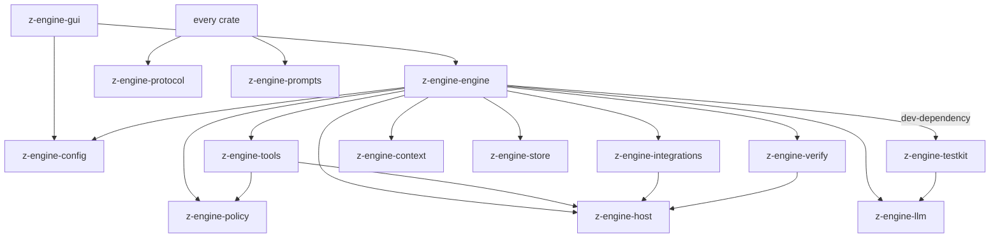

# The crates

Z Engine's Rust code is split into *crates* (Rust packages), each with one
job. This page explains each in plain words: what it owns, what it must not
do, its main modules and who uses it. Binding rules: the [structure contract](../../AGENTS.md#crates);
terms: the [glossary](glossary.md). Part of [How Z Engine works](README.md).

## How the crates fit together

**In plain words.** The crates are like departments of a company: a
dictionary and a script library everyone may consult, specialists that each
do one kind of work, one conductor that coordinates them, and a storefront
where the customer sits.

**How it works**
- Arrows mean "may import". Dependencies only point down, so a low crate
  never knows about a higher one.
- `z-engine-protocol` and `z-engine-prompts` are *leaf* crates: every crate
  may use them, and they use nothing.
- `z-engine-engine` is the only crate that knows the concrete
  implementations; `z-engine-tools` reaches engine services only through
  *capability traits* (ports).
- Only `z-engine-host` touches the operating system; `z-engine-integrations`
  owns its server processes, `z-engine-llm` makes the provider HTTP calls,
  and the GUI shell checks GitHub for updates, installs them, and opens
  project files through the opener plugin. `config` and `store` read and
  write only their own files; `context` and `policy` do no I/O at all.

**For developers**
- The graph matches each crate's `Cargo.toml`. Moving a responsibility
  updates this page, the diagram and [AGENTS.md](../../AGENTS.md) together.

## z-engine-protocol

**In plain words.** The shared dictionary: the exact shape of every message
between the engine, the store and the window, like the standard forms every
office department fills in.

**How it works**
- Owns: ids (session, turn, agent, call, job, ...), the conversation model
  (messages and content blocks), `Command` (window to engine), `Event` and
  `EventEnvelope` (engine to window), snapshots, approvals, questions,
  todos, agents, jobs, usage and verification records.
- Every public type derives `ts_rs::TS`, so its TypeScript twin is
  generated into the frontend.
- Must not: do any I/O or depend on another Z Engine crate.

**For developers**
- [`src/`](../../crates/z-engine-protocol/src/): `commands.rs`, `events.rs`,
  `session.rs`, `content.rs`, `ids.rs`, `permission.rs`, `interaction.rs`,
  `agents.rs`, `jobs.rs`, `verification.rs`, `usage.rs`.
- Used by every crate except prompts. After a change run
  `cargo test -p z-engine-protocol` and commit `ui/src/lib/protocol/`.

## z-engine-prompts

**In plain words.** The script cabinet: every word the model is told, kept
as markdown. The code reads its lines from here and never improvises its
own.

**How it works**
- Owns: all prompt prose under `prompts/<area>/*.md`: system prompts, tool
  descriptions, built-in agents, built-in prompt commands, reminders, and
  auxiliary prompts (compaction summary, titles, web extraction).
- Each file becomes one `pub const` (`include_str!`), compiled into the app.
- Must not: contain logic or depend on anything; no other crate inlines
  prompt text.

**For developers**
- [`prompts/`](../../crates/z-engine-prompts/prompts/): `system/`, `tools/`
  (one file per tool), `agents/` (explore, general, plan, review, verify),
  `commands/` (commit, init, review, security-review), `reminders/`,
  `auxiliary/`. One module per area in [`src/`](../../crates/z-engine-prompts/src/);
  `agents.rs` and `commands.rs` hold the `BUILTIN` lists.
- Used by: context, tools, engine.

## z-engine-llm

**In plain words.** The switchboard to the AI providers: it dials the model
in each provider's language, streams the answer back, and redials when the
line is busy.

**How it works**
- Owns: the `ModelClient` trait (the one seam the engine calls), two wire
  adapters (OpenAI-compatible chat completions and Anthropic Messages),
  streaming decoding and assembly into content blocks, retries with
  back-off, fallback models, the model catalog and cost accounting.
- It sends the provider HTTP requests itself; tests plug in a scripted
  client instead.
- Must not: know about sessions, tools or the window; import anything but
  the leaf crates.

**For developers**
- [`src/`](../../crates/z-engine-llm/src/): `client.rs` (`ModelClient`),
  `anthropic/`, `openai/`, `provider/` (configuration, endpoint detection,
  construction), `transport.rs`, `retry.rs`, `fallback.rs`, `accumulate.rs`,
  `catalog/`, `cost.rs`. Used by: engine, testkit.

## z-engine-config

**In plain words.** The receptionist who knows everyone's standing orders:
it reads the settings files in order, keeps your API keys and trusted
folders, and finds the agents, commands and instructions you wrote.

**How it works**
- Owns: settings layering (defaults, user, project, project-local,
  environment), import of v1 `config.toml`, targeted edits for the settings
  screens, credentials (`auth.json`), workspace trust, on-disk paths, and
  discovery of extensions (agents, commands, skills, rules, output styles)
  and instruction files (`AGENTS.md`).
- Loading never fails: a broken layer is skipped and reported.
- Must not: touch files other than its own; import anything but the leaf
  crates.

**For developers**
- [`src/settings/`](../../crates/z-engine-config/src/settings/) (one file
  per section, clamps in `normalize.rs`),
  [`default_config.toml`](../../crates/z-engine-config/src/default_config.toml),
  `loader.rs`, `merge.rs`, `writer.rs`, `migrate/`, `credentials.rs`,
  `trust.rs`, `paths.rs`, `extensions/`, `instructions.rs`.
- Types export to `ui/src/lib/protocol/config/`. Used by: engine, gui.

## z-engine-policy

**In plain words.** The rulebook the security guard consults: given "this
tool wants to do this", it answers allow, ask or deny. It reads rules; it
never opens a door itself.

**How it works**
- Owns: permission modes, allow/ask/deny rules and their syntax, the
  decision pipeline for file access, command execution and the sandbox, and
  static analysis of shell commands (pipelines, read-only commands, the
  files a command touches).
- A tool describes its call as an `Action`; the policy decides.
- Must not: do any I/O; paths are compared as text.

**For developers**
- [`src/`](../../crates/z-engine-policy/src/): `action.rs` (`Action`),
  `engine.rs` (the policy), `rules/`, `decide/`, `shell/`, `paths.rs`.
- Used by: tools, engine (which builds the policy from settings in
  `z-engine-engine/src/settings/policy.rs`).

## z-engine-host

**In plain words.** The only pair of hands that touches the computer:
files, commands, search, git and web pages all go through it. Everyone else
asks the hands.

**How it works**
- Owns: file access (atomic writes, locks, read tracking), processes and
  background shells (with process-tree kill), the optional command sandbox
  (macOS seatbelt, Linux bubblewrap), search (ripgrep or a built-in engine,
  globs, fuzzy file search), git (status, worktrees, patches), code
  checkpoints in a shadow git repository, web fetch and search, and
  workspace fingerprints.
- Must not: know about sessions, models or permissions; import anything but
  the leaf crates.

**For developers**
- [`src/`](../../crates/z-engine-host/src/): `fs/`, `process/`, `sandbox/`,
  `search/`, `git/`, `checkpoint/`, `web/`, `media.rs`, `fingerprint.rs`.
- Used by: tools, integrations, verify, engine.

## z-engine-integrations

**In plain words.** The interpreter on a conference call with outside
helpers: MCP servers (extra tools) and language servers (code intelligence)
all speak JSON-RPC, and this crate speaks it back.

**How it works**
- Owns: one JSON-RPC core; MCP clients over stdio and streamable HTTP
  (tools, resources, prompts, list-changed notifications); multi-server LSP
  clients (navigation, symbols, diagnostics, rename previews).
- The documented exception to "only host touches the OS": it starts and
  owns its long-lived server processes and speaks HTTP to MCP servers; the
  environment policy and process-tree teardown come from host.
- Must not: import anything but host and the leaf crates.

**For developers**
- [`src/`](../../crates/z-engine-integrations/src/): `jsonrpc/`, `mcp/`,
  `lsp/`, `process/`.
- Used by: engine, whose `src/mcp/` and `src/lsp/` run them per session.

## z-engine-context

**In plain words.** The assistant who packs the model's briefcase: what goes
into each request (instructions, environment, reminders, a map of the code)
and what to summarize when the briefcase is too full.

**How it works**
- Owns: the layered system prompt ordered for prompt-cache stability,
  cache breakpoints, `<system-reminder>` blocks, instruction rendering, the
  tree-sitter repo map, token estimates, the `/context` breakdown,
  compaction planning, and the final pass that shapes messages the way
  every provider accepts.
- Must not: do I/O; callers pass file contents in.

**For developers**
- [`src/`](../../crates/z-engine-context/src/): `system.rs`, `sections.rs`,
  `environment.rs`, `instructions.rs`, `reminders.rs`, `cache.rs`,
  `repo_map/`, `tokens.rs`, `breakdown.rs`, `compaction/`, `wellformed.rs`.
- Used by: engine.

## z-engine-verify

**In plain words.** The inspector with a clipboard: it finds the project's
tests and builds, runs them when asked, and writes down the evidence,
without ever stopping you from finishing.

**How it works**
- Owns: read-only discovery of checks (Cargo, npm/pnpm/yarn/bun, Python,
  Go, Gradle, Maven, .NET, CMake, Make, just, Deno), running one check
  through the host shell into a `CheckRecord`, test-count parsing, choosing
  checks for changed paths, and the per-turn badge.
- Must not: decide whether work may end; import anything but host and the
  leaf crates.

**For developers**
- [`src/`](../../crates/z-engine-verify/src/): `discovery/` (with
  `ecosystems/`), `parse/` (one parser per test runner), `run.rs`,
  `select.rs`, `assess.rs`, `artifact.rs`, `spec.rs`.
- Used by: engine (`src/verify/` holds the modes).

## z-engine-store

**In plain words.** The ship's logbook: every session is written down line
by line as it happens, and can be read back to resume it.

**How it works**
- Owns: one directory per session with `log.jsonl` (append-only records),
  `meta.json` (listing cache), `agents/<id>.jsonl` (subagent transcripts)
  and `artifacts/` (spilled outputs, check logs, images); replay into the
  state a session resumes from; import of v1 transcripts.
- Must not: touch files outside its sessions directory; import anything but
  the leaf crates.

**For developers**
- [`src/`](../../crates/z-engine-store/src/): `store.rs` (`SessionStore`),
  `log.rs`, `append.rs`, `record.rs`, `replay.rs`, `meta.rs`, `heal.rs`,
  `listing.rs`, `artifacts.rs`, `legacy/`. Used by: engine.

## z-engine-tools

**In plain words.** The toolbox: every action the model can take (read,
edit, run a command, search, ask, send a helper) is one labelled tool with
an input form and a safety card.

**How it works**
- Owns: the `Tool` trait, the per-call `ToolCtx`, the ordered registry, one
  file per built-in tool, MCP tools named `mcp__server__tool`, and shared
  cores (the edit engine, format-specific reading, notebooks, diffs).
- Each tool turns its input into a policy `Action` and can preview its
  effect; the engine's gate decides, then calls it.
- Must not: import the engine. Engine services come through ports
  (`AgentPort`, `InteractionPort`, `JobPort`, `SkillPort`, `CheckPort`,
  `LspPort`, `McpPort`, `SideModelPort`); the OS only through host.

**For developers**
- [`src/`](../../crates/z-engine-tools/src/): `tool.rs`, `context/`,
  `ports/`, `registry.rs`, `names.rs`, [`builtin/`](../../crates/z-engine-tools/src/builtin/)
  (one file per tool; `list.rs` registers them), `mcp_tool.rs`, `edit/`,
  `reading/`, `notebook/`, `text/`.
- Used by: engine. Tool list: [core features](features-core.md).

## z-engine-engine

**In plain words.** The conductor: it runs each session, asks the model,
sends every tool call through the gate, keeps helpers and background jobs
going, saves everything, and announces each change as an event.

**How it works**
- Owns: the public `Engine` API and GUI queries; a session actor and event
  emitter per open session; agent runs (round loop, context pressure,
  compaction, stop boundary); the tool gate (hooks, policy, batched
  approvals, ordered execution); the broker for approvals, questions and
  plans; subagents, worktrees and jobs; hooks; slash commands; per-session
  MCP and language servers; verification modes.
- It alone knows the concrete implementations and wires them into tools
  through ports.
- Must not: depend on the GUI, inline prompt prose, or reach the OS other
  than through host and integrations.

**For developers**
- [`src/`](../../crates/z-engine-engine/src/): `engine/` (API, catalog,
  export, and [`queries/`](../../crates/z-engine-engine/src/engine/queries/):
  diffs, git summary and worktrees, context breakdown, catalogs, file
  search, MCP tests, trust), `session/`, `run/`, `batch/`, `broker/`,
  `orchestration/`, `ports/`, `hooks/`, `commands/`, `mcp/`, `lsp/`,
  `verify/`, `settings/`.
- Uses every crate above (testkit only in tests); used by: gui. Contract: [v2 engine architecture](../architecture/v2-engine.md).

## z-engine-testkit

**In plain words.** The rehearsal kit: a pretend model that follows a
script, throwaway project folders and an event recorder, so tests run the
real engine without a real provider.

**How it works**
- Owns: `ScriptedModel` (a deterministic `ModelClient`), `FixtureRepo`
  (temporary projects, optionally git repositories) and `EventRecorder`
  (collects events and waits for conditions).
- Must not: ship in the product; it is only ever a dev-dependency.

**For developers**
- [`src/`](../../crates/z-engine-testkit/src/): `model.rs`, `repo.rs`,
  `events.rs`. Uses protocol and llm; used by: engine tests.

## z-engine-gui

**In plain words.** The storefront: the Svelte window is the shop floor you
see, and the Rust shell behind it is the counter that passes your orders to
the engine.

**How it works**
- Shell (`src-tauri`): builder wiring (one tokio runtime, plugins, handler
  list), `AppState` (engine, workspaces, pet store, active project), the
  `engineEvent` bridge, the window (dark vibrancy on macOS, dark Mica on
  Windows 11, else solid), the log and the pet's growth
  (`<data dir>/z-engine-gui.log`, `pet.json`), `#[tauri::command]`s.
- Frontend (`ui`): Svelte 5, Bits UI and Vite; generated protocol types,
  invoke wrappers, one event listener, pure reducers, stores, primitives,
  screens, and every stylesheet in `styles/`.
- Must not: be imported by any crate. The shell uses only engine, protocol
  and config (settings files, credentials, trust, discovery); screens never
  call `invoke()` or import `bits-ui`; no terminal or headless replacement.

**For developers**
- Shell: [`src-tauri/src/`](../../crates/z-engine-gui/src-tauri/src/):
  `main.rs`, `state.rs`, `events.rs`, `window.rs`, `workspaces.rs`,
  `pet.rs`, `layers.rs`, `guard.rs`, `ipc.rs`, `commands/`.
- Frontend: [`ui/src/`](../../crates/z-engine-gui/ui/src/): `lib/protocol/`,
  `lib/commands/`, `lib/runtime/`, `lib/domain/`, `lib/stores/`, `lib/ui/`,
  `styles/`, `components/`. How it works: [the desktop app](features-desktop-app.md);
  rules: [GUI UI guide](../design/gui-ui-guide.md).

## Where do I change X?

Paths are relative to `crates/`. Every row also means updating the docs
listed in the [documentation contract](../AGENTS.md#3-what-to-update-for-each-kind-of-change).

| To… | Change |
|---|---|
| add a tool | `z-engine-tools/src/builtin/<name>.rs` implementing `Tool`; its name in `names.rs` and an instance in `builtin/list.rs`; description `z-engine-prompts/prompts/tools/<name>.md` with a `pub const` in `src/tools.rs` |
| change a prompt or tool description | the markdown in [`z-engine-prompts/prompts/<area>/`](../../crates/z-engine-prompts/prompts/); a new file also needs a `pub const` in `src/<area>.rs` |
| add a setting | field and default in [`z-engine-config/src/settings/<section>.rs`](../../crates/z-engine-config/src/settings/) (clamps in `normalize.rs`), a commented example in `default_config.toml`, a v1 mapping in `migrate/convert.rs` if v1 had it; run `cargo test -p z-engine-config` |
| add a slash command | engine built-in: [`z-engine-engine/src/commands/`](../../crates/z-engine-engine/src/commands/) (`catalog.rs`); prompt built-in: `z-engine-prompts/prompts/commands/<name>.md` plus `BUILTIN` in `src/commands.rs`; app-only: `z-engine-gui/ui/src/lib/stores/uiCommands.ts` |
| add a built-in agent | `z-engine-prompts/prompts/agents/<name>.md` (frontmatter) plus a `BUILTIN` entry in [`src/agents.rs`](../../crates/z-engine-prompts/src/agents.rs) |
| add a hook event | `HOOK_EVENTS` in [`z-engine-config/src/settings/hooks.rs`](../../crates/z-engine-config/src/settings/hooks.rs); fire it from `z-engine-engine/src/hooks/` |
| add a protocol event | a variant of `Event` in [`z-engine-protocol/src/events.rs`](../../crates/z-engine-protocol/src/events.rs); emit it in the engine; a `case` in `z-engine-gui/ui/src/lib/domain/sessionView/reduce.ts`; run `cargo test -p z-engine-protocol` and commit the TypeScript |
| add an IPC command | a `#[tauri::command]` fn in `z-engine-gui/src-tauri/src/commands/<domain>.rs`, listed in `generate_handler!` in `main.rs`; a wrapper in `ui/src/lib/commands/<domain>.ts`; engine data from [`engine/queries/<topic>.rs`](../../crates/z-engine-engine/src/engine/queries/) |
| add a settings screen | `z-engine-gui/ui/src/components/settings/<Name>Tab.svelte`; its id in `SettingsTab` (`ui/src/lib/stores/ui.svelte.ts`), an entry in `SETTINGS_TABS` (`SettingsNav.svelte`), a `SETTINGS_SECTIONS` group and its `SETTING_ENTRIES` for search (`ui/src/lib/domain/settings/searchIndex.ts`), and a branch in [`SettingsPage.svelte`](../../crates/z-engine-gui/ui/src/components/settings/SettingsPage.svelte); form logic in `ui/src/lib/domain/settings/` |
| change permission logic | rules and syntax in [`z-engine-policy/src/rules/`](../../crates/z-engine-policy/src/rules/), the decision pipeline in `src/decide/`, shell analysis in `src/shell/`; settings to policy in `z-engine-engine/src/settings/policy.rs` |
| add a check parser | `z-engine-verify/src/parse/<runner>.rs` plus runner detection in [`parse/dispatch.rs`](../../crates/z-engine-verify/src/parse/dispatch.rs); discovery for a new ecosystem in `discovery/ecosystems/` |
| add a provider adapter | a module like `anthropic/` or `openai/` in [`z-engine-llm/src/`](../../crates/z-engine-llm/src/) implementing `ModelClient`; construction in `provider/build.rs`, endpoint detection in `provider/detect.rs`; the settings-side `ProviderKind` in `z-engine-config/src/settings/provider.rs`, mapped in `z-engine-engine/src/settings/client.rs` |

See also: [How Z Engine works](README.md) · [The desktop app](features-desktop-app.md) ·
[v2 engine architecture](../architecture/v2-engine.md) · [AGENTS.md](../../AGENTS.md)
