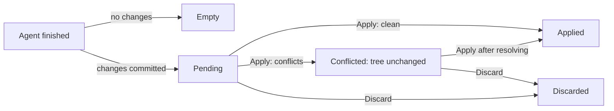
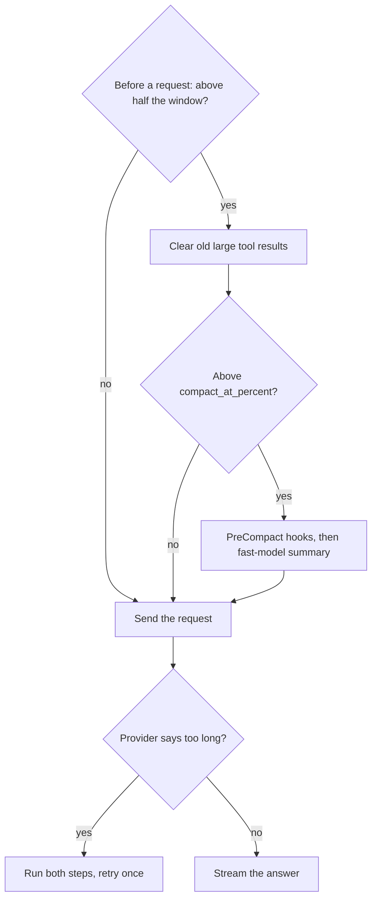

# Agents and context

Part of [How Z Engine works](README.md). How the agent hands work to
subagents and background jobs, and how Z Engine decides what goes into each
request to the model: instruction files, rules, compaction, prompt caching
and the repository map. Terms are explained in the [glossary](glossary.md);
the round loop these features plug into is in [Core features](features-core.md).
To *use* them, see [Agents](../user-guide/04-agents.md) and
[Memory and context](../user-guide/07-memory-and-context.md).

## Subagents

**In plain words.** A subagent is a helper the main agent sends off to do
one job. Like a colleague sent to the library, it starts with a clean desk,
sees only its task, and brings back a short report instead of every page.

**How it works.**

1. The model calls the `Agent` tool with a short `description`, a
   self-contained `prompt` and a `subagent_type` from the registry.
2. The engine turns that definition into a child *agent run* with its own
   system prompt, tools, model, permission mode and turn budget.
3. The child runs the same round loop as the main agent, with its own
   transcript and the same permission gate (its approval cards appear in
   the main transcript, labelled with its agent id). Its final message goes
   back to the caller.

| Kind | What the caller gets | Stopped by |
|---|---|---|
| **Foreground** (default) | The report plus a footer: duration, tool calls, tokens, cost, changed files | **Esc**, with the turn that started it |
| **Background** (`run_in_background: true`) | A job id at once; a reminder when the agent finishes | `JobKill` or **Kill**; it survives **Esc** |
| **Resume** (`resume: "<agent_id>"`) | A finished agent continues with its full earlier transcript; `prompt` is the follow-up | As foreground or background |

Each run has a *depth*: the main agent is 0, its subagents 1, theirs 2. A
run whose depth reaches `agents.max_depth` has no `Agent` tool, and a call
past the limit is refused with "subagents may nest at most N level(s) deep".

| Setting (`[agents]`) | Default | Effect |
|---|---|---|
| `max_concurrent` | 6 | Concurrency *slots* per chat, read when it opens. Top-level and background agents wait for a slot; nested foreground agents use their caller's, so a full chat cannot deadlock on its own children. |
| `max_depth` | 2 | How deep agents may nest; 0 disables subagents. |
| `max_turns` | 200 | Model rounds per run; a definition's `maxTurns` overrides it. |
| `session_cost_cap_usd` | 0 (off) | Checked before every round; runs stop once the chat has spent this much. |

**For developers.** In `z-engine-engine/src/orchestration/`:
[`spawn.rs`](../../crates/z-engine-engine/src/orchestration/spawn.rs) starts
a child (depth check, then an awaited task or a background job);
[`launch.rs`](../../crates/z-engine-engine/src/orchestration/launch.rs)
prepares it (resumed transcript, worktree, cancellation, `needs_slot`);
[`blueprint.rs`](../../crates/z-engine-engine/src/orchestration/blueprint.rs)
builds its `AgentSpec`;
[`child.rs`](../../crates/z-engine-engine/src/orchestration/child.rs) takes a
slot and runs the shared loop;
[`sink.rs`](../../crates/z-engine-engine/src/orchestration/sink.rs) writes
`agents/<id>.jsonl`;
[`tracker.rs`](../../crates/z-engine-engine/src/orchestration/tracker.rs)
persists `LogRecord::AgentUpdated` and emits `AgentUpdated`, whose
`AgentStatus` is in
[`protocol/src/agents.rs`](../../crates/z-engine-protocol/src/agents.rs).
The [`Agent` tool](../../crates/z-engine-tools/src/builtin/agent.rs) reaches
the engine only through the `AgentPort` trait.

## The agent registry and custom agents

**In plain words.** The registry is the staff list the main agent picks
helpers from. Z Engine ships five job descriptions; you can add your own as
markdown files, or replace a built-in with one of the same name.

**How it works.**

- Built-ins: `general`, `explore`, `plan`, `review`, `verify`, each a
  markdown file with YAML *frontmatter* (a settings header).
- Custom definitions come from four folders, lowest precedence first:
  `~/.claude/agents/` (with Claude compatibility on),
  `~/.config/z-engine/agents/`, `<project>/.claude/agents/`,
  `<project>/.z-engine/agents/`. A later file replaces a same-named one, and
  a custom agent named like a built-in replaces it. Project files that link
  outside the project, and files that don't parse, are skipped (the latter
  with a notification). The registry is rebuilt on settings reload.
- The `Agent` tool's description lists every type with its `description`;
  that is how the model chooses. `@agent-<name>` in your message adds a
  reminder to use that type.
- The definition shapes the child: `tools`/`disallowedTools` filter tools
  (a trailing `*` matches by prefix); `model` is `inherit`, a role (`main`,
  `fast`, `review`) or a model id; `permissionMode` falls back to the
  caller's; `maxTurns` to `agents.max_turns`; `isolation` is `shared` or
  `worktree`. Subagents never get `AskUserQuestion`, `ExitPlanMode` or
  `ApplyAgentChanges`.

**For developers.**
[`orchestration/registry.rs`](../../crates/z-engine-engine/src/orchestration/registry.rs)
merges the built-ins (`BUILTIN` in
[`prompts/src/agents.rs`](../../crates/z-engine-prompts/src/agents.rs)) with
definitions parsed by [`extensions/agent.rs`](../../crates/z-engine-config/src/extensions/agent.rs)
and found by [`discover.rs`](../../crates/z-engine-config/src/extensions/discover.rs).

## Worktree isolation and merge-back

**In plain words.** A worktree agent works on a photocopy of your project.
Your files stay untouched until you review its changes and either copy them
over (apply) or throw the photocopy away (discard).

**How it works.**

1. With `isolation: worktree` (from the definition or the `Agent` call) the
   engine creates a *git worktree* (a second checkout of the repository) at
   `.z-engine/worktrees/<agent-id>` on a new branch `zengine/<agent-id>`,
   from the current commit. A resumed worktree agent re-enters it.
2. The worktree is the agent's root: it may read the main project but
   writes only in its worktree (the sandbox, when on, enforces the same
   bound). A note in its system prompt says where it works.
3. At the end its changes are committed on the branch and summarized
   (files, diffstat). With no changes it ends `Empty` and is cleaned up;
   otherwise it is `Pending` until the parent calls `ApplyAgentChanges`
   (approved like any edit) or you click **Apply** or **Discard**.
4. **Apply** tries a clean `git apply` of the branch's diff and, failing
   that, a three-way merge against a throwaway index that mirrors your
   working tree, so your uncommitted changes merge too and your real index
   is never touched. A lock runs merges one at a time.
5. If conflicts remain, every touched file is put back byte for byte, the
   state becomes `Conflicted` and the worktree stays: resolve and apply
   again, or discard. **Discard** removes the worktree and its branch.

An applied merge counts as a change to the tree for the next turn, like a
`!` shell command. When a chat opens, git forgets worktrees whose folders
are gone; pending ones stay. Outside a git repository the agent works in
the shared folder and a notice says why.

**For developers.** [`orchestration/worktree.rs`](../../crates/z-engine-engine/src/orchestration/worktree.rs)
creates, commits, applies and discards;
[`decide.rs`](../../crates/z-engine-engine/src/orchestration/decide.rs)
handles the GUI's `ApplyAgentChanges` / `DiscardAgentChanges` commands;
[`recover.rs`](../../crates/z-engine-engine/src/orchestration/recover.rs)
prunes on open. Git work is in the host
([`git/worktree.rs`](../../crates/z-engine-host/src/git/worktree.rs),
[`git/patch.rs`](../../crates/z-engine-host/src/git/patch.rs)).
`AgentInfo.worktree` carries the `WorktreeState`.

## Background jobs

**In plain words.** A background job is a cake in the oven with a timer
set: the agent keeps working, peeks in when it wants, and gets a ping when
it's done.

**How it works.**

- One list holds background shells (`Bash` with `run_in_background: true`,
  such as a dev server or a long test run) and background agents. Both
  return a job id at once.
- `JobOutput` returns output since the last read; `filter` (a regular
  expression) keeps matching lines, and `wait_ms` (up to 600,000) waits for
  the job to finish first. For an agent, the output is its latest message.
  `JobKill` stops a shell with its whole process tree, or cancels an agent.
- When a job exits, a "job finished" reminder is queued for the agent that
  started it. The Jobs tab follows `JobUpdated` events (throttled per job;
  an exit always emits); its **Kill** button sends `KillJob`.
- Jobs belong to the chat, not the turn: **Esc** leaves them running. When
  the session shuts down (for example when you close the app), every job
  still running is killed.

**For developers.** Shells live in the host's
[`process/background/`](../../crates/z-engine-host/src/process/background/);
[`session/jobs.rs`](../../crates/z-engine-engine/src/session/jobs.rs) merges
them with background agents and queues the reminder. The tools
[`job_output.rs`](../../crates/z-engine-tools/src/builtin/job_output.rs) and
[`job_kill.rs`](../../crates/z-engine-tools/src/builtin/job_kill.rs) use `JobPort`.

## Instruction files

**In plain words.** Instruction files are sticky notes the agent re-reads
before every answer: how to build, what to avoid, house style. The agent
remembers nothing between chats on its own; these files are its memory.

**How it works.**

| Scope | Files, lowest precedence first |
|---|---|
| User | `~/.claude/CLAUDE.md`, then `~/.config/z-engine/AGENTS.md` |
| Project | In each folder from the repository root down to the project: `CLAUDE.md`, then `AGENTS.md` |
| Local | `CLAUDE.local.md`, then `AGENTS.local.md` in the project folder |
| Nested | `CLAUDE.md` and `AGENTS.md` in subfolders, added later |

- Later files win, so at each level `AGENTS.md` beats `CLAUDE.md`
  (`CLAUDE.md` is read only with `compat.claude` on). The walk up stops at
  the folder holding `.git` and never includes your home folder. Each file
  is cut at 64 KiB; project files linking outside the project are skipped.
- User, project and local files form the *instructions* section of the
  system prompt, inside the cached prefix ([Prompt caching](#prompt-caching)).
- After each tool batch the engine collects the files every call read or
  wrote. A nested file joins the first time the agent touches a file in or
  below its folder, once per agent, as a `<system-reminder>` (a tagged note
  appended to the next request).
- A `# ` note or `/remember` appends a bullet and reloads the chat's
  instructions. Instructions guide; they never grant permissions.

**For developers.** Discovery:
[`config/src/instructions.rs`](../../crates/z-engine-config/src/instructions.rs);
nested files: [`settings/instructions.rs`](../../crates/z-engine-engine/src/settings/instructions.rs),
queued by `announce_nested` in
[`batch/execute.rs`](../../crates/z-engine-engine/src/batch/execute.rs);
rendering: [`context/src/instructions.rs`](../../crates/z-engine-context/src/instructions.rs)
and the templates in [`prompts/reminders/`](../../crates/z-engine-prompts/prompts/reminders/).

## Glob-scoped rules

**In plain words.** A rule is a sticky note attached to certain drawers: it
only comes out when the agent opens a matching file.

**How it works.** Rules are markdown files under `rules/` (subfolders
allowed) in `<project>/.z-engine/` or `~/.config/z-engine/`, never read from
`.claude/`. `alwaysApply: true` puts a rule in the system prompt like an
instruction file. `globs` are gitignore-style patterns relative to the
agent's root (for a worktree agent, its worktree); a pattern without `/`
matches at any depth. Such a rule joins as a reminder the first time the
agent reads or writes a matching file, once per agent. A rule with neither
is never used.

**For developers.** Parsing in
[`extensions/rule.rs`](../../crates/z-engine-config/src/extensions/rule.rs);
matching in [`settings/rules.rs`](../../crates/z-engine-engine/src/settings/rules.rs),
queued by `announce_nested` like nested instruction files.

## The context window and token estimates

**In plain words.** The context window is the model's desk: only so many
pages fit. Z Engine keeps a running estimate of how full it is, so it can
tidy up before anything falls off.

**How it works.**

- A *token* is a chunk of about four characters. The window size comes from
  the model catalog; `model.context_window` overrides it, and unknown models
  are assumed to have 128,000 tokens.
- The *context meter* takes the prompt size the provider reported for the
  last request and adds local estimates for the messages added since. With
  no report (a new or just-compacted conversation) it estimates everything.
- Local estimates: characters divided by four, rounded up; a Chinese,
  Japanese or Korean character is one token; an image or other media block
  is 1,600; tools count their name, description and schema.
- The island at the top of the window shows how full the context is (a
  ring while the agent is idle, and in its panel); `/context` shows the
  numbers by prompt layer.
  Estimates only steer compaction; cost uses the provider's reported usage.

**For developers.**
[`context/src/tokens.rs`](../../crates/z-engine-context/src/tokens.rs)
(estimates), [`breakdown.rs`](../../crates/z-engine-context/src/breakdown.rs)
(`/context` layers), [`run/meter.rs`](../../crates/z-engine-engine/src/run/meter.rs)
(`ContextMeter`).

## Compaction

**In plain words.** When the desk gets crowded, Z Engine first files away
old printouts (tool output), leaving a note saying where they went. If that
is not enough, it summarizes the older conversation and carries on.

**How it works.** Before each round, relief runs on the *working set* (the
messages sent to the model); the transcript you see is never shortened.

1. **Clearing old tool results**, above half the window: every tool result
   except the newest `context.keep_recent_tool_results` (default 8) that is
   at least 1,000 characters long becomes a short `[cleared …]` marker. The
   original goes to the session's `artifacts/` folder and the marker says
   where. Results are edited in place, so every tool call keeps its result.
2. **Summary compaction**, above `context.compact_at_percent` (default 92,
   allowed 50–99): `PreCompact` hooks run, then the `fast` model summarizes
   older history, which is replaced by one summary message; recent
   messages stay word for word.
3. **Where the cut goes:** at the start of a real user turn or at any
   assistant message, so one long agentic turn can be split in the middle,
   but never between a tool call and its result. The latest cut that keeps
   enough recent messages wins; fewer than two messages are never
   summarized.
4. If the provider says a request is too long, both steps run whatever the
   estimate says, and the request is retried once. If summarizing fails, a
   warning appears and the run continues with what it has.

A **Context compacted** divider shows the sizes before and after.
`/compact [focus]` and **Compact Now** take the same path. The todo list
survives. Subagents compact the same way, but their stored transcript keeps
every message, so a resumed agent starts from its full history.

**For developers.** Planning is pure, in `z-engine-context`:
[`compaction/micro.rs`](../../crates/z-engine-context/src/compaction/micro.rs)
and [`compaction/summary.rs`](../../crates/z-engine-context/src/compaction/summary.rs)
(`plan_summary` holds the split rules). The engine does the I/O: `relieve`
in [`run/pressure.rs`](../../crates/z-engine-engine/src/run/pressure.rs),
and the summary job shared with `/compact` in
[`run/compact.rs`](../../crates/z-engine-engine/src/run/compact.rs), which
uses the prompt [`auxiliary/compact.md`](../../crates/z-engine-prompts/prompts/auxiliary/compact.md).

## Prompt caching

**In plain words.** Most of each request repeats the previous one. Prompt
caching lets the provider keep that unchanged beginning ready, like a café
that starts your usual order when you walk in: cheaper and faster.

**How it works.**

- The system prompt is built stable parts first: base prompt, environment
  snapshot (taken when the chat opens), instructions, skills list, output
  style, repository map, all cacheable. A per-request note (a worktree
  agent's location) comes last, outside the cache.
- *Cache breakpoints* mark "cache everything up to here": on the last
  cacheable system section, the tool list, and the last two user messages
  (tool-result rounds included). The newest writes the cache for the next
  request; the one before reads what the last request wrote.
- Changing information (todo nudges, finished jobs, steering) travels as
  reminders on the last user message, so the prefix stays the same.
- Anthropic caches natively and OpenRouter passes the markers through, both
  on by default; other providers need `provider.cache_control`. Cache reads
  and writes are priced separately (see
  [Providers and models](features-integrations-and-safety.md#providers-and-models)).

**For developers.**
[`context/src/system.rs`](../../crates/z-engine-context/src/system.rs)
(`build_system`) and [`cache.rs`](../../crates/z-engine-context/src/cache.rs)
(`system_breakpoint`, `message_breakpoints`);
[`run/request.rs`](../../crates/z-engine-engine/src/run/request.rs) inserts
the repo map after the last cached section, and the
[Anthropic](../../crates/z-engine-llm/src/anthropic/request.rs) and
[OpenAI-compatible](../../crates/z-engine-llm/src/openai/request.rs)
adapters write the provider fields.

## The repository map

**In plain words.** The repository map is a table of contents for your
code: the main functions and types, most important first, so the agent
knows where to look before opening files.

**How it works.**

1. When a chat opens, a background task walks the project, newest files
   first (up to 20,000 paths), keeping at most 400 source files and
   skipping files over 200 KiB (usually generated).
2. *Tree-sitter* (a parser library) outlines each file's definitions in
   Rust, TypeScript, TSX, JavaScript, Python and Go: functions, types,
   classes, methods, constants. Function bodies and Rust test-only code are
   left out.
3. A file earns a point for every reference another file makes to a name it
   defines. Files the main agent touched rank first, then their neighbours,
   then the rest, cut to `context.repo_map_chars` (default 6,000).
4. The first request waits for the map; then it stays byte for byte the
   same until a compaction or settings reload rebuilds it, so the cached
   prefix survives. Worktree agents don't get it; `context.repo_map = false`
   turns it off.

**For developers.**
[`context/src/repo_map/`](../../crates/z-engine-context/src/repo_map/)
outlines (one walker per language), ranks (`rank.rs`) and renders;
[`run/repo_map.rs`](../../crates/z-engine-engine/src/run/repo_map.rs) reads
the files and keeps the section stable. To add a language, add a walker,
its extensions in `language.rs`, the tree-sitter grammar, and tests.

See also: [Integrations and safety](features-integrations-and-safety.md) ·
[Crates](crates.md) · [v2 engine architecture](../architecture/v2-engine.md)
