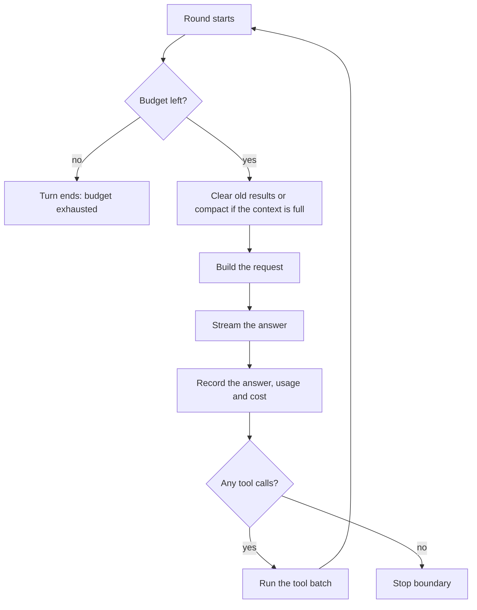
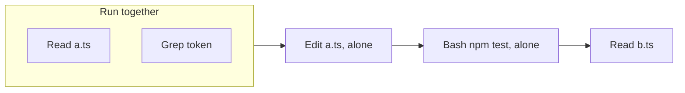
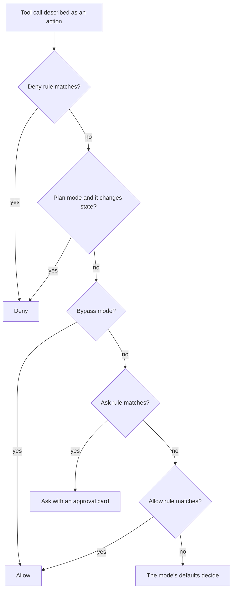

# Core features

The heart of Z Engine: how a conversation runs, how tools run and how
permissions decide. Steering, plan mode, hooks and commands are in
[Interaction features](features-interaction.md). Each section goes from
plain words to developer detail; see
[How to read these pages](README.md#how-to-read-these-pages).

## Conversations, turns and rounds

**In plain words**

A chat is a notebook with a running conversation. Each message you send
starts a *turn*: one errand for the agent. Inside a turn the agent works in
small steps called *rounds*: think, act, look at what happened, repeat.

**How it works**

- A [session](glossary.md#session) is one chat. Its log is written to disk
  before the app shows each change, so a chat reopens where it was, even
  after a crash; a turn cut short by closing the app shows as interrupted.
- A [turn](glossary.md#turn) starts when you send a message or a prompt
  command: `UserPromptSubmit` [hooks](features-interaction.md#hooks) may add context or block it;
  the opening message is built (your text and attachments, steering left
  from an ended turn, reminders such as "plan mode is on"); a
  [checkpoint](glossary.md#checkpoint) of your files is taken before any
  tool may run; then rounds run until the
  [stop boundary](glossary.md#stop-boundary) ends the turn.
- A [round](glossary.md#round) is one request to the model and what follows:
  1. **Budgets:** at most `agents.max_turns` rounds per run (default 200),
     and the session cost cap `agents.session_cost_cap_usd` (0 means off).
     A spent budget ends the turn as *budget exhausted*.
  2. **Context pressure:** above half of the
     [context window](glossary.md#context-window) old tool results are
     cleared; above `context.compact_at_percent` (default 92) older history
     is summarized ([compaction](glossary.md#compaction)).
  3. **Request and stream:** the request is built and the answer streams in.
  4. **Record:** the answer, its token usage and its cost are saved.
  5. **Next:** tool calls run as a [batch](#tools-and-tool-batches) and a
     new round starts; no tool calls leads to the stop boundary.
- One rule keeps every conversation valid: each tool call gets exactly one
  tool result, in order, even when denied or cancelled. That is why a chat
  can be resumed with any provider.

**For developers**

- [session/actor.rs](../../crates/z-engine-engine/src/session/actor.rs)
  owns the command channel and runs each turn in its own task;
  [session/turn.rs](../../crates/z-engine-engine/src/session/turn.rs) runs
  one turn and [session/prompt.rs](../../crates/z-engine-engine/src/session/prompt.rs)
  builds its opening message.
- `AgentRun` in [run/agent.rs](../../crates/z-engine-engine/src/run/agent.rs)
  drives the rounds with its neighbours in `run/`: `budget.rs`,
  `pressure.rs` and `compact.rs`, `request.rs`, `stream.rs` (a
  context-overflow error forces compaction and one retry), `usage.rs` and
  `stop.rs`.
- [session/journal.rs](../../crates/z-engine-engine/src/session/journal.rs)
  appends each record before its event is published;
  [replay.rs](../../crates/z-engine-store/src/replay.rs) rebuilds the state
  from the log without repeating side effects.
- Protocol: command `submit`; events `turnStarted`, `usageUpdated`,
  `retrying` and `turnFinished` (outcome, usage, cost and badge).
- If you add an early exit to the loop, close every open tool call first.

## Tools and tool batches

**In plain words**

Tools are the agent's hands; each does one job, such as reading a file or
running a command. When the model asks for several at once, the engine
works like a careful assistant: look-only jobs happen together, anything
that changes something happens alone and in order, and every request gets
an answer.

**How it works**

Z Engine has 22 built-in [tools](glossary.md#tool), named and shaped like
Claude Code's:

| Group | Tools |
|---|---|
| Files | `Read`, `Write`, `Edit`, `MultiEdit`, `NotebookEdit`, `Glob`, `Grep` |
| Shell and background jobs | `Bash`, `JobOutput`, `JobKill` |
| Web | `WebFetch`, `WebSearch` |
| Working with you | `TodoWrite`, `AskUserQuestion`, `ExitPlanMode` |
| Skills and agents | `Skill`, `Agent`, `ApplyAgentChanges` |
| Evidence and code intelligence | `Verify`, `LSP` |
| MCP resources | `ListMcpResources`, `ReadMcpResource` |

[MCP servers](glossary.md#mcp-server) add tools named
`mcp__<server>__<tool>`; `LoadMcpTools` appears only while MCP schemas are
deferred ([integrations and safety](features-integrations-and-safety.md)).
Each run gets a filtered list: an agent definition may limit its tools,
`AskUserQuestion` and `ExitPlanMode` are for the main agent only, `Agent`
disappears at the nesting limit, and tools of services that are off are
left out.

All tool calls in one model answer form a *batch*:

1. **Check:** an unknown tool, malformed JSON or a missing required field
   gives an error result.
2. **Gate:** `PreToolUse` hooks run, then the
   [permission decision](#permissions-modes-rules-and-approvals).
3. **Approvals:** every call that needs approval shows its card at once,
   and you answer in any order. The batch runs when all are answered.
4. **Run in order:** neighbouring calls that are safe together (read-only
   calls, and `Agent`) run at the same time; any other call is a *barrier*
   and runs alone.
5. **Report:** each call streams progress; `PostToolUse` hooks may add
   feedback to its result.
6. **Return:** all results go back in call order in one message, with
   queued [steering](glossary.md#steering) and reminders.

Results always pair with calls: a call you denied returns "The user denied
this action" plus your feedback, a rule's refusal returns its reason, a
cancelled call returns "cancelled by user", a failure returns its error.
The tools also protect you:

- Edits need a fresh read: the engine remembers what each file looked like
  when the model last read it and refuses an edit based on stale content.
- A write marks the turn as changed (for the
  [verification badge](glossary.md#verification-badge)); touching a new
  folder can bring in its `AGENTS.md` or matching
  [rule files](glossary.md#rule-file) as a reminder.
- `Bash` keeps its working directory between calls and can start background
  jobs, read with `JobOutput` and stopped with `JobKill`.
- Very long outputs are shortened; the full text is saved as an artifact in
  the session folder.

**For developers**

- The `Tool` trait in [tool.rs](../../crates/z-engine-tools/src/tool.rs):
  `is_read_only`, `is_concurrency_safe` (defaults to read-only; `Agent`
  opts in, `TodoWrite`, `AskUserQuestion` and `ExitPlanMode` opt out),
  `action` (what the policy decides on), `title`, `preview` (the approval
  card's diff or command) and `call`.
- Names in [names.rs](../../crates/z-engine-tools/src/names.rs); stable
  order in [registry.rs](../../crates/z-engine-tools/src/registry.rs) so the
  [prompt cache](glossary.md#prompt-cache) holds; one file per tool in
  [builtin/](../../crates/z-engine-tools/src/builtin/mod.rs); descriptions in
  [prompts/tools/](../../crates/z-engine-prompts/prompts/tools/). Each call
  gets a `ToolCtx` ([ctx.rs](../../crates/z-engine-tools/src/context/ctx.rs))
  and reaches the engine only through [ports](../../crates/z-engine-tools/src/ports/mod.rs).
- The engine's batch lives in [batch/](../../crates/z-engine-engine/src/batch/mod.rs):
  `toolset.rs` (the offered list), `schema.rs`, `gate.rs`, `approval.rs`,
  [execute.rs](../../crates/z-engine-engine/src/batch/execute.rs) (ordering),
  `call.rs` and `progress.rs` (at most about twenty progress events a second).
- Events: `toolStarted`, `toolProgress` and `toolFinished`, whose
  `ToolStatus` is `ok`, `error`, `denied` or `cancelled`.
- To add a tool, follow the "a tool" row in [AGENTS.md](../../AGENTS.md#how-to-add-things-follow-exactly).

## Permissions: modes, rules and approvals

**In plain words**

Permissions work like the key cards of an office building. Some doors open
for everyone, some need a swipe each time, some stay locked. The *mode*
sets how strict the building is today; *rules* are your exceptions for
particular doors.

**How it works**

Each tool call is first described as an *action*: read paths, write paths,
run a command, fetch a URL, search the web, start an agent, call an MCP
tool, load a skill, or other. The policy decides on the action, never on
raw tool input, so a `Read(./.env)` deny rule also stops `cat .env`.

| [Mode](glossary.md#permission-mode) (label in the app) | Setting | In short |
|---|---|---|
| **Ask** | `default` | Asks before edits and before commands not proven read-only |
| **Auto-accept edits** | `acceptEdits` | Edits inside the project and simple file commands run; other commands ask |
| **Plan** | `plan` | Read-only: anything that changes state is refused |
| **Bypass** | `bypass` | Everything runs except what a deny rule forbids |

- **Shell lines** are split into their commands, including `$(...)` and
  wrappers. A deny or ask [rule](glossary.md#rule) matches if it matches
  *any* command; an allow rule helps only if it covers *every* command. A
  command counts as read-only only when the engine can prove it.
- **Protected paths** (any `.git` folder, the project's `.z-engine/`,
  `.claude/settings.json`, `.claude/settings.local.json`, `.mcp.json`)
  always ask before a change, even with an allow rule or in Auto-accept
  edits; only Bypass allows them.
- **Approval cards** ask a question ("Allow Bash to run npm test?") over a
  preview (a diff or a command). **Allow once** runs this call; **Always
  allow…** then **In this chat** also adds the suggested rule, such as
  `Bash(npm test:*)`, for the rest of the chat, and **In this project**
  also saves it to `.z-engine/settings.local.toml`; **Deny…** sends your
  optional feedback to the model. Targets outside the
  project can be allowed for the session only; protected paths never offer
  a rule. Subagents pass the same gate, with cards labelled by agent.

**For developers**

- `z-engine-policy` does no I/O. [action.rs](../../crates/z-engine-policy/src/action.rs)
  defines `Action`; [decide/pipeline.rs](../../crates/z-engine-policy/src/decide/pipeline.rs)
  holds the order above, with `files.rs` (paths, protected paths),
  `execute.rs` (shell rules, read-only and Auto-accept defaults, the
  suggested `Bash(<prefix>:*)` rule) and `sandbox.rs` beside it;
  [rules/](../../crates/z-engine-policy/src/rules/mod.rs) parses rules and
  gitignore-style paths; [shell/](../../crates/z-engine-policy/src/shell/mod.rs)
  lexes command lines and proves them read-only.
- [settings/policy.rs](../../crates/z-engine-engine/src/settings/policy.rs)
  builds a session's policy (a rebuild keeps session rules and `/add-dir`
  folders); [broker/approvals.rs](../../crates/z-engine-engine/src/broker/approvals.rs)
  announces a batch's approvals together and audits each answer.
- Protocol ([permission.rs](../../crates/z-engine-protocol/src/permission.rs)):
  `PermissionMode`, `ApprovalRequest` and `ApprovalDecision` (`AllowOnce`,
  `AllowSession { rule }`, `AllowProject { rule }`, `Deny { feedback }`);
  commands `resolveApproval`, `setMode`; events `approvalRequested`,
  `approvalResolved`, `modeChanged`.
- A new tool returns the most specific `Action`, and `action()` must stay
  conservative even for malformed input.

See also: [How Z Engine works](README.md) ·
[Interaction features](features-interaction.md) ·
[Agents and context](features-agents-and-context.md) ·
[Integrations and safety](features-integrations-and-safety.md) ·
[Glossary](glossary.md) · [User guide](../user-guide/README.md)
