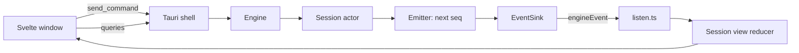

# The desktop app

How the Z Engine window talks to the engine, how events become the screen
you see, and how the app updates itself. What each screen and panel does is
on [The desktop app's screens](features-desktop-screens.md). Terms such as
*snapshot* and *reducer* are in the [glossary](glossary.md); the code layout
is on [the crates page](crates.md), the UI rules in the
[GUI UI guide](../design/gui-ui-guide.md).

## The window and the engine

**In plain words.** The app has two halves: the window you look at and the
engine that does the work. They talk like a waiter and a kitchen: orders go
in through one hatch, and news comes back through another.

**How it works**
1. Opening a chat asks the engine to open that *session* (`open_session`).
   The engine replies with the session id, then sends a full *snapshot*.
2. Everything you do in a chat (send a message, approve a tool, change mode,
   rewind) becomes one *command*, sent through a single call,
   `send_command`, with the session id.
3. The engine does not answer commands directly. Everything that happens
   becomes an *event*: turn started, text arrived, tool finished, approval
   needed.
4. The events of all chats travel on one channel, `engineEvent`, each
   wrapped in an *envelope* with its session id and a sequence number.
5. Simple questions with an immediate answer are *queries*: saved chats, a
   subagent transcript, a diff, a project's branch and changed-file count,
   the context breakdown, the last request.

**For developers**
- [`src-tauri/src/commands/`](../../crates/z-engine-gui/src-tauri/src/commands/)
  has one file per domain (session, catalog, workspace, settings, access,
  extensions, app, update, pet), all in `generate_handler!` in `main.rs`; the
  webview reaches them only through `ui/src/lib/commands/*.ts`, screens
  through [`lib/runtime/actions.ts`](../../crates/z-engine-gui/ui/src/lib/runtime/actions.ts).
- `Engine::send` ([`engine/api.rs`](../../crates/z-engine-engine/src/engine/api.rs))
  hands the `Command` to the session actor, which never blocks on the model
  or a tool ([runtime model](../architecture/v2-engine.md#runtime-model)).
- [`events.rs`](../../crates/z-engine-gui/src-tauri/src/events.rs) emits
  each `EventEnvelope` as `engineEvent`, numbered per session by
  [`session/emitter.rs`](../../crates/z-engine-engine/src/session/emitter.rs);
  the one subscription is `initEvents()` in
  [`lib/runtime/listen.ts`](../../crates/z-engine-gui/ui/src/lib/runtime/listen.ts).
  Adding an IPC command: [Where do I change X?](crates.md#where-do-i-change-x)

## One dictionary for both languages

**In plain words.** The engine speaks Rust and the window speaks
TypeScript, so both need the same dictionary of message shapes. It is
written once, in Rust, and the window's copy is printed from it, like a menu
printed in two languages from one master.

**How it works**
- Every shape that crosses the gap (commands, events, messages, ids,
  snapshots, settings) is one Rust type. A generator, *ts-rs*, writes a
  matching TypeScript file for each type when the crate's tests run.
- Commands and events are *tagged unions*: each value has a `type` field
  (`"submit"`, `"toolFinished"`) and camelCase fields, so the compiler
  checks that every case is handled; a Rust change without regenerated
  files fails the frontend type check instead of breaking at runtime.

**For developers**
- Source: [`crates/z-engine-protocol/src/`](../../crates/z-engine-protocol/src/)
  (`Command` in `commands.rs`, `Event` and `EventEnvelope` in `events.rs`,
  `SessionSnapshot` in `session.rs`); settings types come from
  `z-engine-config`, `ModelInfo` and `Pricing` from `z-engine-llm`.
- Output: [`ui/src/lib/protocol/`](../../crates/z-engine-gui/ui/src/lib/protocol/),
  set by `TS_RS_EXPORT_DIR` in [`.cargo/config.toml`](../../.cargo/config.toml).
  Regenerate with `cargo test -p z-engine-protocol` (or `-p z-engine-config`,
  `-p z-engine-llm`), commit the files in the same change, never edit them.

## From events to a screen

**In plain words.** The window never asks the engine what a chat looks like
now. It keeps its own copy of every chat and updates it with each piece of
news, like a scorekeeper who updates the board after every play.

**How it works**
1. An envelope arrives; the window finds that session's *view* (or starts an
   empty one).
2. An envelope whose sequence number is not newer than the last one applied
   is a duplicate and is dropped. A snapshot (sent on open, after a rewind
   or reload, and when an open chat is opened again) always applies and
   resets the count.
3. A *reducer*, a function from (old view, one event) to a new view, updates
   it: text deltas grow the streaming reply (replaced by the complete message
   on `assistantFinished`), `toolFinished` completes a tool card, and
   `approvalRequested` adds a pending approval.
4. Some events also ask for a side effect: a passing notice (only for the
   chat on screen), `!cmd` output for the shell drawer, a chat-list
   refresh when a title changes or a turn starts or ends, or XP for the
   [pet](features-desktop-screens.md#the-pet) when a turn finishes or a
   helper's worktree changes are applied (in any chat).

**For developers**
- Pure reducers, tested with vitest without a browser: `applyEnvelope`,
  `eventEffects` and unread marks in
  [`lib/domain/sessions.ts`](../../crates/z-engine-gui/ui/src/lib/domain/sessions.ts);
  one `case` per `Event` type in [`lib/domain/sessionView/reduce.ts`](../../crates/z-engine-gui/ui/src/lib/domain/sessionView/reduce.ts)
  (a new variant needs a case and a test there); transcript turns, blocks
  and tool-run groups in `lib/domain/timeline/`.
- Live state: `SessionsStore` in
  [`lib/runtime/sessions.svelte.ts`](../../crates/z-engine-gui/ui/src/lib/runtime/sessions.svelte.ts)
  (`views`, `active`, `activity`, `unread`, `apply`); `effects.ts` runs the
  side effects (`petGrowth` goes to `lib/runtime/pet.svelte.ts`);
  `applyLocal` reduces window-made events (such as `/help`).

## Many chats at once

**In plain words.** Several chats can work at the same time, in one project
or several. It is like a kitchen with several orders on the rail: you watch
one, and the others keep cooking.

**How it works**
- The engine keeps every opened session alive with its own actor, and every
  session's events arrive on the same channel, so a background chat keeps
  streaming, running tools and waiting for approvals. Opening a live chat
  again only re-sends its snapshot; a saved one resumes from its log.
- The sidebar lists each project (branch, uncommitted-file count) with its
  chats. A chat you are not looking at is marked **Needs you**, **Working**,
  *unread* when a turn ended (coloured by outcome and verification), or with
  a warning when its last turn failed, hit a budget or was interrupted; a
  folded project shows its most urgent mark. Quitting closes every session.

**For developers**
- Engine: `open_session`, `send`, `close_session`, `shutdown` in
  [`engine/api.rs`](../../crates/z-engine-engine/src/engine/api.rs). Window:
  `activityMap` and `markRead` in `lib/domain/sessions.ts`, `sidebarMark`
  and `sidebarModel` in `lib/domain/`, [`components/sidebar/AppSidebar.svelte`](../../crates/z-engine-gui/ui/src/components/sidebar/AppSidebar.svelte).
- Branch and count: `git_summary` ([`Engine::git_summary`](../../crates/z-engine-engine/src/engine/queries/git.rs))
  through `lib/runtime/projects.svelte.ts`, refreshed at start, on window
  focus, when a project is added and when a turn ends.

## The window's glass and title bar

**In plain words.** The window is dark and frosted: where the system allows,
the desktop shows softly through it, and the sidebar, side panel, composer
and island float over the chat like panes of frosted glass.

**How it works**
- macOS: an overlay title bar with the traffic lights inside the sidebar
  card's head, over dark HUD vibrancy. Windows 11: a frameless window over
  dark Mica, with the app's own minimize, maximize and close buttons.
  Windows 10 and Linux have no native material, so the window is solid
  dark. The window starts solid and lets the material through once the
  shell confirms it applied.
- On the window sit the content sheet (the chat and pages), glass for the
  floating controls, and stronger glass for popovers, menus and dialogs.
  The glass blurs what is behind it on every platform; Reduce Transparency
  makes every layer solid.
- Double-clicking an empty part of the title bar, the sidebar's head, the
  side panel's head or a full-window page's bar maximizes or restores the
  window, like a native title bar.

**For developers**
- [`src-tauri/src/window.rs`](../../crates/z-engine-gui/src-tauri/src/window.rs)
  builds the window and applies the material; `app_info` reports it as
  `nativeGlass`, and `applyWindowMaterial()` in `lib/platform.ts` sets
  `html.native-glass` or `html.solid-surfaces`.
- The layers are tokens in `styles/tokens.css` and the `.sheet`, `.glass`
  and `.glass-strong` classes in `styles/materials.css`
  ([UI guide](../design/gui-ui-guide.md)). The double-click handler is in
  `chrome/AppShell.svelte`; the Windows buttons are `chrome/WindowControls.svelte`.

## Self-updates

**In plain words.** At start-up the app checks for a newer version, and it
can install it and restart itself, like a phone app update that waits for
you to say yes.

**How it works**
1. The app asks GitHub for the latest release and compares versions; if the
   check fails (no network, 8-second timeout), nothing is shown.
2. If it is newer, a notice says so once, an **Update** button appears in
   the sidebar's footer and a dot marks **About & Updates** in Settings,
   which has **Update & Restart** and a link to the release page.
3. Installing asks the updater for the release's `latest.json`, downloads
   the bundle for your platform and checks its signature against the public
   key built into the app.
4. Progress arrives as `update-progress` events (downloading with bytes and
   percent, installing, ready); then the app restarts itself.

**For developers**
- [`commands/update.rs`](../../crates/z-engine-gui/src-tauri/src/commands/update.rs)
  (`check_for_update`, `install_update`, `open_release_url`); endpoint and
  key under `plugins.updater` in
  [`tauri.conf.json`](../../crates/z-engine-gui/src-tauri/tauri.conf.json);
  signed bundles come from [`release.yml`](../../.github/workflows/release.yml).
- Window: [`lib/updateStore.ts`](../../crates/z-engine-gui/ui/src/lib/updateStore.ts)
  (check, install, `update-progress` listener), `sidebar/SidebarFooter`,
  `settings/AboutTab`.

See also: [How Z Engine works](README.md) · [Everyday use](../user-guide/02-everyday-use.md) ·
[Settings reference](../user-guide/12-settings-reference.md) · [The crates](crates.md) ·
[v2 engine architecture](../architecture/v2-engine.md)
