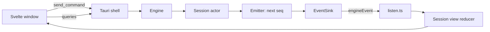

# The desktop app

How the Z Engine window talks to the engine, how events become the screen
you see, and what each main surface does. Terms such as *snapshot* and
*reducer* are in the [glossary](glossary.md); the code layout is on
[the crates page](crates.md), the UI rules in the [GUI UI guide](../design/gui-ui-guide.md).

## The window and the engine

**In plain words.** The app has two halves: the window you look at and the
engine that does the work. They talk like a waiter and a kitchen: orders go
in through one hatch, and news comes back through another.

**How it works**
1. Opening a chat asks the engine to open that *session* (`open_session`).
   The engine replies with the session id, then sends a full *snapshot*.
2. Everything you do in a chat (send a message, approve a tool, change mode,
   rewind) becomes one *command*, sent through a single call,
   `send_command`, with the session id.
3. The engine does not answer commands directly. Everything that happens
   becomes an *event*: turn started, text arrived, tool finished, approval
   needed.
4. The events of all chats travel on one channel, `engineEvent`, each
   wrapped in an *envelope* with its session id and a sequence number.
5. Simple questions with an immediate answer are *queries*: list saved
   chats, read a subagent transcript, fetch a diff, show the last request.

**For developers**
- [`src-tauri/src/commands/`](../../crates/z-engine-gui/src-tauri/src/commands/)
  has one file per domain (session, catalog, workspace, settings, access,
  extensions, app, update), all listed in `generate_handler!` in `main.rs`.
  The webview reaches them only through `ui/src/lib/commands/*.ts`; screens
  call [`lib/runtime/actions.ts`](../../crates/z-engine-gui/ui/src/lib/runtime/actions.ts).
- `Engine::send` ([`engine/api.rs`](../../crates/z-engine-engine/src/engine/api.rs))
  hands the `Command` to the session actor, which never blocks on the model
  or a tool ([runtime model](../architecture/v2-engine.md#runtime-model)).
- [`events.rs`](../../crates/z-engine-gui/src-tauri/src/events.rs) emits
  each `EventEnvelope` as `engineEvent`; the engine's
  [`session/emitter.rs`](../../crates/z-engine-engine/src/session/emitter.rs)
  numbers each session's events and delivers them in `seq` order.
- The one subscription is `initEvents()` in
  [`lib/runtime/listen.ts`](../../crates/z-engine-gui/ui/src/lib/runtime/listen.ts).
  Adding an IPC command: [Where do I change X?](crates.md#where-do-i-change-x)

## One dictionary for both languages

**In plain words.** The engine speaks Rust and the window speaks
TypeScript, so both need the same dictionary of message shapes. It is
written once, in Rust, and the window's copy is printed from it, like a menu
printed in two languages from one master.

**How it works**
- Every shape that crosses the gap (commands, events, messages, ids,
  snapshots, settings) is one Rust type. A generator, *ts-rs*, writes a
  matching TypeScript file for each type when the crate's tests run.
- Commands and events are *tagged unions*: each value has a `type` field
  (`"submit"`, `"toolFinished"`) and camelCase fields, so the compiler
  checks that every case is handled; a Rust change without regenerated
  files fails the frontend type check instead of breaking at runtime.

**For developers**
- Source: [`crates/z-engine-protocol/src/`](../../crates/z-engine-protocol/src/)
  (`Command` in `commands.rs`, `Event` and `EventEnvelope` in `events.rs`,
  `SessionSnapshot` in `session.rs`); settings types come from
  `z-engine-config`, `ModelInfo` and `Pricing` from `z-engine-llm`.
- Output: [`ui/src/lib/protocol/`](../../crates/z-engine-gui/ui/src/lib/protocol/),
  set by `TS_RS_EXPORT_DIR` in [`.cargo/config.toml`](../../.cargo/config.toml).
  Regenerate with `cargo test -p z-engine-protocol` (or `-p z-engine-config`,
  `-p z-engine-llm`), commit the files in the same change, never edit them.

## From events to a screen

**In plain words.** The window never asks the engine what a chat looks like
now. It keeps its own copy of every chat and updates it with each piece of
news, like a scorekeeper who updates the board after every play.

**How it works**
1. An envelope arrives; the window finds that session's *view* (or starts an
   empty one).
2. An envelope whose sequence number is not newer than the last one applied
   is a duplicate and is dropped. A snapshot (sent on open, after a rewind
   or reload, and when an open chat is opened again) always applies and
   resets the count.
3. A *reducer*, a function from (old view, one event) to a new view, updates
   it: text deltas grow the streaming reply (replaced by the complete message
   on `assistantFinished`), `toolFinished` completes a tool card, and
   `approvalRequested` adds a pending approval.
4. Some events also ask for a side effect: a passing notice (only for the
   chat on screen), `!cmd` output for the shell overlay, or a chat-list
   refresh when a title changes or a turn starts or ends.

**For developers**
- Pure reducers, tested with vitest without a browser: `applyEnvelope`,
  `eventEffects` and unread marks in
  [`lib/domain/sessions.ts`](../../crates/z-engine-gui/ui/src/lib/domain/sessions.ts);
  one `case` per `Event` type in [`lib/domain/sessionView/reduce.ts`](../../crates/z-engine-gui/ui/src/lib/domain/sessionView/reduce.ts)
  (a new variant needs a case and a test there); turns and blocks for the
  transcript in `lib/domain/timeline/`.
- Live state: `SessionsStore` in
  [`lib/runtime/sessions.svelte.ts`](../../crates/z-engine-gui/ui/src/lib/runtime/sessions.svelte.ts)
  (`views`, `active`, `activity`, `unread`, `apply`); `effects.ts` runs the
  side effects; `applyLocal` reduces window-made events (such as `/help`
  output) without touching the sequence.

## Many chats at once

**In plain words.** Several chats can work at the same time, in one project
or several. It is like a kitchen with several orders on the rail: you watch
one, and the others keep cooking.

**How it works**
- The engine keeps every opened session alive with its own actor. Opening a
  live chat again only re-sends its snapshot; opening a saved one resumes it
  from its log.
- Every event of every session arrives on the same channel, so the window
  updates all views, not only the visible one. A background chat keeps
  streaming, running tools and waiting for approvals.
- The sidebar marks each chat you are not looking at: **Needs you** (a
  pending approval, question or plan), **Working**, an *unread* mark when a
  turn ended (coloured by its outcome and verification, cleared when you
  open the chat), or a warning when its last turn failed, hit a budget or
  was interrupted. A collapsed workspace shows its most urgent mark.
- The title-bar island also tells you when another chat needs you; clicking
  it opens that chat.
- Switching is instant: the window shows the view it already has and calls
  `open_session` only for a chat not yet opened since the app started.
- Quitting closes every session: turns stop, jobs end, logs are flushed.

**For developers**
- Engine: `open_session`, `send`, `close_session`, `shutdown` in
  [`engine/api.rs`](../../crates/z-engine-engine/src/engine/api.rs). Window:
  `openSession` in `lib/runtime/actions.ts`, `activityMap` and `markRead` in
  `lib/domain/sessions.ts`, `sidebarMark` in `lib/domain/sessionOutcome.ts`,
  and [`components/sidebar/Sidebar.svelte`](../../crates/z-engine-gui/ui/src/components/sidebar/Sidebar.svelte).

## The transcript and tool cards

**In plain words.** The transcript is the chat history drawn as cards. Each
tool call is a small card, like a receipt you can unfold for the details.

**How it works**
- A turn shows your message, the reply (Markdown, with a collapsible
  thinking section), its tool calls, and a footer with duration, tokens,
  cost and the verification badge (`Verified`, `Unverified`, `Failed`,
  `NotApplicable`) with its check evidence.
- A tool card follows `toolStarted`, `toolProgress` (streamed output) and
  `toolFinished` with a status: ok, error, denied or cancelled.
- The card depends on the tool's *family*: edits and writes show a diff;
  Bash shows the command, live output and exit code; Agent shows the
  subagent's type, model, tokens, cost and a transcript link; TodoWrite
  shows the list; WebFetch and WebSearch have a web card; everything else,
  including MCP tools (`mcp__server__tool`), uses a generic card.

**For developers**
- [`components/chat/`](../../crates/z-engine-gui/ui/src/components/chat/)
  (`Transcript`, `TurnView`, `TurnFooter`, `VerificationBadge`, ...);
  [`chat/tools/ToolCall.svelte`](../../crates/z-engine-gui/ui/src/components/chat/tools/ToolCall.svelte) picks
  the card from the family in [`lib/domain/tools/toolMeta.ts`](../../crates/z-engine-gui/ui/src/lib/domain/tools/toolMeta.ts).
- A tool gets its own card through a `FAMILIES` entry in `toolMeta.ts`, a
  card in `components/chat/tools/` and a branch in `ToolCall.svelte`.

## Approval, question and plan cards

**In plain words.** When the agent needs your say (permission, an answer, or
approval of a plan), it pauses and puts a card in the chat, like a builder
who knocks before taking down a wall.

**How it works**
1. The engine's *gate* decides a tool call must ask (see
   [core features](features-core.md)) and emits `approvalRequested` with a
   title and a preview, such as the diff of an edit.
2. The card offers: allow once, allow for this session (a session rule),
   allow for this project (the rule is also saved to
   `.z-engine/settings.local.toml`), or deny with feedback for the model.
   The choice goes back as `resolveApproval`.
3. `AskUserQuestion` shows a question card (`answerQuestion`; dismissing
   sends no answers). `ExitPlanMode` shows a plan card: approve it, choosing
   the mode to continue in and optionally editing the plan, or ask for
   changes (`resolvePlan`).
4. While a card waits you can still steer, change mode or cancel. Cards from
   a subagent carry that agent's label.
5. An untrusted project that sets anything trust withholds (hooks, MCP
   servers, checks, permission modes or allow rules, shell, provider, web
   or language-server settings) gets a trust banner (`trustRequired`,
   answered with `trustWorkspace`).

**For developers**
- [`components/planning/PendingInteractions.svelte`](../../crates/z-engine-gui/ui/src/components/planning/PendingInteractions.svelte)
  renders `chat/ApprovalCard`, `planning/QuestionCard` and
  `planning/PlanCard`; the banner is `chat/TrustBanner`.
- Types: `ApprovalRequest`, `ApprovalDecision`, `PlanDecision`,
  `Question`, `QuestionAnswer`. The engine's
  [`broker/`](../../crates/z-engine-engine/src/broker/) holds pending
  requests so the session actor keeps accepting commands.

## The title-bar island

**In plain words.** A small capsule in the title bar is the app's status
light: what the agent is doing, passing notices, todo progress and whether
you are needed, like the strip at the top of a phone that shows a running
timer or an incoming call.

**How it works**
- It shows one state at a time, most urgent first: this chat needs you, a
  notice, a provider retry, work in progress, a turn that just ended,
  another chat needs you, idle. A second activity can show in a bubble.
- A small ring shows todo progress while the agent works and context use
  while it is idle. The agent keeps its to-do list with the `TodoWrite`
  tool; the engine saves it in the session log and emits `todosUpdated`.
- A dot marks warnings or errors you have not seen. Clicking opens the chat
  that needs you, dismisses a notice, or expands a panel with the todo
  checklist, context use and a **Compact** button, cost, running agents and
  recent notices.

**For developers**
- `components/chrome/AgentIsland.svelte` and its `Island*` parts;
  `islandState` in `lib/domain/island.ts`
  picks the state from the view, `todos.ts`, `contextMeter.ts`, `activity.ts`
  and the toast store; the checklist is `planning/TodoChecklist.svelte`.

## The agents and jobs panel

**In plain words.** Helpers the agent sends off (*subagents*) and commands
left running in the background (*jobs*) are listed in one panel, like a
board showing who is out on an errand.

**How it works**
- A subagent emits `agentStarted`, then `agentUpdated`; a background shell
  or agent emits `jobUpdated`. The panel lists them with status, usage and
  cost; open it from the island or the palette (**Agents**, **Background
  jobs**).
- Opening an agent loads its own transcript from disk (`agent_transcript`).
- You can stop a job (`killJob`), and apply (`applyAgentChanges`) or discard
  (`discardAgentChanges`) the work of an agent that ran in its own git
  *worktree*.

**For developers**
- [`components/agents/`](../../crates/z-engine-gui/ui/src/components/agents/)
  (`WorkPanel`, `AgentRow`, `JobRow`, `AgentTranscript`); counts from
  `workCounts` in `lib/domain/agentTree.ts`; types `AgentInfo`, `JobInfo`.
  How agents run: [agents and context](features-agents-and-context.md).

## The diff panel

**In plain words.** The review panel shows what changed in your files, like
"track changes" in a word processor: either what this chat changed, or
everything not yet committed.

**How it works**
- **Chat** scope compares the project with the chat's first *checkpoint*, a
  copy of your files kept in a hidden git repository, without taking a new
  one. **Git** scope compares the working tree with your last commit
  (`HEAD`), with line counts. Both need git.
- Pick a file to see its diff (cached per scope while the panel is open).
  Open it with **Review changes** or ⌘D / Ctrl+D.

**For developers**
- [`components/overlays/DiffPanel.svelte`](../../crates/z-engine-gui/ui/src/components/overlays/DiffPanel.svelte)
  with `DiffFileTree` and `DiffView`. Chat scope: `session_changed_files`,
  `session_diff_for_file` ([`engine/queries/changes.rs`](../../crates/z-engine-engine/src/engine/queries/changes.rs)).
  Git scope: `list_changed_files`, `diff_for_file` ([`engine/queries/git.rs`](../../crates/z-engine-engine/src/engine/queries/git.rs),
  which also creates the worktree for **New task in git worktree**).

## The prompt inspector

**In plain words.** The prompt inspector lets you look over the agent's
shoulder at exactly what was last sent to the model, like reading a letter
before it goes in the post.

**How it works**
- It fetches the last request sent to the provider (`inspect_request`) and
  lays out its system sections, tools and messages, with a breakdown of
  where the context tokens go. You can copy all of it.
- `/context` (**Context usage** in the palette) asks the engine for that
  breakdown by category (`contextReport`); the island shows how full the
  context is.

**For developers**
- [`overlays/PromptInspector.svelte`](../../crates/z-engine-gui/ui/src/components/overlays/PromptInspector.svelte)
  with `lib/promptInspectView.ts`, reading `Engine::last_request`; context
  figures from `lib/domain/contextMeter.ts` (type `ContextBreakdown`).

## Settings and scopes

**In plain words.** Settings are stacked like transparent sheets: defaults,
then yours, then the project's, then your private project tweaks. The
settings screen picks the sheet you write on and shows where each value
comes from.

**How it works**
- Tabs (⌘, or Ctrl+,): Models, Providers, Permissions, Hooks, Agents &
  Commands, MCP, Verification, Memory, Advanced, Appearance, About &
  Updates.
- Most tabs have a scope bar with three writable files: **User** (every
  project), **This project** (`.z-engine/settings.toml`, shared) and
  **Personal (local)** (`.z-engine/settings.local.toml`, kept out of git). A
  badge names where each value came from: Default, User, Project, Personal
  or Environment.
- Saving writes that one file and reloads settings: every open session for
  a user change, only that project's sessions otherwise.
- Agents, commands, skills, rules and `AGENTS.md` files are edited as files,
  after a check that the path is one the app knows.

**For developers**
- [`components/settings/`](../../crates/z-engine-gui/ui/src/components/settings/):
  `SettingsPage.svelte` switches on the tab ids listed in `SettingsNav.svelte`;
  one `*Tab.svelte` per tab; form logic in `lib/domain/settings/`.
- Shell: [`commands/settings.rs`](../../crates/z-engine-gui/src-tauri/src/commands/settings.rs)
  (`set_setting`, `add_permission_rule`, `set_hooks`, ...), `layers.rs`
  (scope to file), `commands/access.rs` (keys, trust) and
  `commands/extensions.rs` with `guard.rs` (path checks).

## The composer, palette and shortcuts

**In plain words.** The composer is the message box; the command palette is
a search box for the whole app: press ⌘K, type a few letters, and jump to a
chat, a workspace or an action.

**How it works**
- The composer sends `submit`. While a turn runs, a new message is queued as
  steering (pills you can edit, sent as `editQueue`); ⌘Enter / Ctrl+Enter
  sends `interrupt` and Esc sends `cancel`. It also offers `@` file and
  agent mentions, `/` commands, `!cmd` shell commands (`shell`), `#` memory
  notes and image attachments.
- The palette (⌘K / Ctrl+K) lists recent chats, workspaces, actions and
  controls such as the permission mode.
- Global shortcuts (⌘ on macOS, Ctrl elsewhere): K palette, N new chat,
  B sidebar, D diff panel, comma settings. In the composer, Shift+Enter adds
  a line, Shift+Tab cycles the permission mode, ↑ and ↓ walk your history.

**For developers**
- [`chat/Composer.svelte`](../../crates/z-engine-gui/ui/src/components/chat/Composer.svelte);
  keys in [`lib/domain/composerKeys.ts`](../../crates/z-engine-gui/ui/src/lib/domain/composerKeys.ts); app-only slash commands in `lib/stores/uiCommands.ts`.
- [`overlays/CommandPalette.svelte`](../../crates/z-engine-gui/ui/src/components/overlays/CommandPalette.svelte)
  on the `Combobox` primitive from `lib/ui/`, items from
  `lib/paletteActions.ts`; global keys in `App.svelte`.

## Self-updates

**In plain words.** At start-up the app checks for a newer version, and it
can install it and restart itself, like a phone app update that waits for
you to say yes.

**How it works**
1. The app asks GitHub for the latest release and compares versions; if the
   check fails (no network, 8-second timeout), nothing is shown.
2. If it is newer, a notice says so once and the **Settings** button in the
   title bar gets a dot; **Settings → About & Updates** has **Update &
   Restart** and a link to the release page.
3. Installing asks the updater for the release's `latest.json`, downloads
   the bundle for your platform and checks its signature against the public
   key built into the app.
4. Progress arrives as `update-progress` events (downloading with bytes and
   percent, installing, ready); then the app restarts itself.

**For developers**
- [`commands/update.rs`](../../crates/z-engine-gui/src-tauri/src/commands/update.rs)
  (`check_for_update`, `install_update`, `open_release_url`); endpoint and
  key under `plugins.updater` in
  [`tauri.conf.json`](../../crates/z-engine-gui/src-tauri/tauri.conf.json);
  signed bundles come from [`release.yml`](../../.github/workflows/release.yml).
- Window: [`lib/updateStore.ts`](../../crates/z-engine-gui/ui/src/lib/updateStore.ts)
  (check, install, `update-progress` listener), `chrome/TopBar`, `settings/AboutTab`.

See also: [How Z Engine works](README.md) · [Everyday use](../user-guide/02-everyday-use.md) ·
[Settings reference](../user-guide/12-settings-reference.md) · [The crates](crates.md) ·
[v2 engine architecture](../architecture/v2-engine.md)
