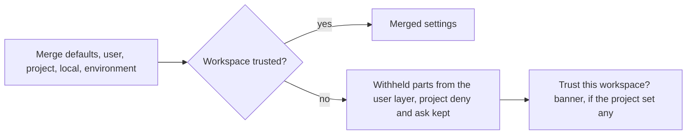

# Integrations and safety

Part of [How Z Engine works](README.md). Outside helpers, recorded checks,
what is kept on disk, model providers, and the limits set by workspace
trust and the sandbox. Terms are in the [glossary](glossary.md). To *use*
them, see [MCP and code intelligence](../user-guide/09-mcp-and-code-intelligence.md),
[Verification](../user-guide/10-verification.md), [Models, providers and cost](../user-guide/11-models-providers-and-cost.md),
[Sessions and data](../user-guide/13-sessions-and-data.md) and [Permissions and safety](../user-guide/03-permissions-and-safety.md).

## MCP servers

**In plain words.** An [MCP server](glossary.md#mcp-server) is a helper
program that gives the agent new tools, such as "create a GitHub issue" or
"query the database". Like adapters in a power strip, each one adds a
device while the agent keeps working the same way.

**How it works.**

1. When a chat opens, every enabled server starts in the background
   (project-defined ones only in a
   [trusted workspace](#settings-layers-and-workspace-trust)). A local
   server is a program talking over its input and output (*stdio*); a
   remote one is reached at a URL (*streamable HTTP*). A notice lists the
   ready and failed ones; `/mcp` shows each one's state.
2. Each server lists its tools. They join the agent's tool list as
   `mcp__<server>__<tool>` (other characters become `_`), minus the
   server's `disabled_tools`. When a server announces that its tools
   changed, the list is refreshed.
3. Calls pass the same permission gate as built-in tools. MCP tools ask by
   default, even read-only ones, until a [rule](glossary.md#rule) such as
   `mcp__github` allows them.
4. *Resources* (files or documents a server exposes) are read with
   `ListMcpResources` and `ReadMcpResource`. A server's *prompts* become
   [slash commands](glossary.md#slash-command) named
   `/mcp__<server>__<prompt>`.
5. Tool definitions take up context. Above 40 MCP tools in total, the
   model gets only their names and one-line summaries in a reminder, loads
   the definitions it needs with `LoadMcpTools`, and can call them from its
   next response on.
6. If a server crashes or its connection drops, its tools stay listed and
   the next call reconnects it once before giving up. A settings change
   restarts only the servers whose entries changed.

**For developers.** The client is
[`integrations/src/mcp/`](../../crates/z-engine-integrations/src/mcp/)
(`manager.rs` with `McpManager` and reconnect-once, `transport.rs` and
`http.rs`, `naming.rs`) over the JSON-RPC core in `jsonrpc/`. Per session,
[`engine/src/mcp/`](../../crates/z-engine-engine/src/mcp/) keeps one
manager per server (`hub.rs`), reconciles them on reload (`lifecycle.rs`),
builds the catalog (`catalog.rs`, `DEFER_ABOVE = 40`) and tracks loaded
tools (`deferred.rs`); prompts become commands in
[`commands/catalog.rs`](../../crates/z-engine-engine/src/commands/catalog.rs).
The three MCP tools are `list_mcp_resources.rs`, `read_mcp_resource.rs`
and `load_mcp_tools.rs` in [`builtin/`](../../crates/z-engine-tools/src/builtin/).

## Language servers

**In plain words.** A [language server](glossary.md#language-server) is
the program your code editor uses to understand code: where a function is
defined, who calls it, what does not compile. Z Engine asks the same
helpers, like asking a local guide instead of reading the whole map.

**How it works.**

1. Nothing starts up front. The first time the agent asks about a file,
   the engine picks the server for that file type (rust-analyzer,
   typescript-language-server, pyright or basedpyright, gopls, clangd, or
   one from `[lsp.servers]`) and starts it if its program is installed. A
   failed start is remembered; a server that crashes is restarted at most
   three times.
2. The `LSP` tool asks for definitions, references, hover text,
   implementations, callers and callees, symbols, diagnostics and rename
   previews (the edits are shown, never applied). It is a reading tool, so
   `Read(...)` rules apply.
3. After the agent writes a file, the engine looks for fresh errors. Only
   a server that is already running and has analysed the file before is
   waited on, for at most about two seconds; up to 20 error lines per file
   are appended to the write's result. A server still starting or indexing
   adds nothing, so edit-heavy work never stalls; one not running yet is
   started in the background for later writes. Warnings are left out.

**For developers.** The client is
[`integrations/src/lsp/`](../../crates/z-engine-integrations/src/lsp/):
`spec.rs` (built-in servers), `routing.rs` (file to server), `manager.rs`
(`LspManager`: lazy start, cached failures, `MAX_RESTARTS = 3`) and
`progress.rs` (busy while an indexing token is open). In the engine,
[`lsp/`](../../crates/z-engine-engine/src/lsp/) runs the manager on its own
thread (`hub.rs`, `worker.rs`), serves the
[`LSP` tool](../../crates/z-engine-tools/src/builtin/lsp.rs) (`query.rs`)
and appends post-write errors (`after_write.rs`, `WAIT` of 2 s). A new
built-in server is a spec in `spec.rs` plus a test.

## Verification

**In plain words.** "The tests pass" from the model is a claim; a recorded
test run is evidence. Z Engine keeps the receipts: every check the agent
runs is written down, and the turn's badge is read from the receipts,
never from the model's words.

**How it works.**

1. **Discovery.** When a chat opens, the engine reads build files
   (`Cargo.toml`, `package.json`, `pyproject.toml`, `go.mod` and more) up to
   four folders deep to find [checks](glossary.md#check): test, build,
   typecheck, lint and format commands. Discovery never runs anything.
   `[[verification.checks]]` entries add checks or replace a discovered
   one with the same id.
2. **Running.** The agent runs a check with `Verify`, through the normal
   permission gate (and the sandbox, when on). The engine stores a *check
   record*: command, exit code, pass or fail, test counts, duration, the
   output (its end inline, all of it as an artifact) and a
   [fingerprint](glossary.md#fingerprint) of the project before and after.
   Test runs through plain `Bash` are not recorded, so they never count.
3. **Freshness.** A fingerprint is a short digest of every file's size and
   modification time. When a file changes after a check, the current
   fingerprint no longer matches the record: the check is *stale*.
4. **The badge.** For a turn that changed files, the engine reads the
   latest record of each check (see the table below).
5. **Modes** (`verification.mode`) act at the
   [stop boundary](glossary.md#stop-boundary) of a turn that changed
   files: `off` does nothing; `report` (default) only computes the badge;
   `auto` runs the `auto_checks` when evidence is missing and sends
   failures back to the model; `strict` also makes it keep going until
   Verified. `max_continuations` (default 3) caps the send-backs.
6. **Untrusted projects:** project-defined checks are withheld and `auto`
   and `strict` run nothing; `Verify` can still run discovered checks.

| [Badge](glossary.md#verification-badge) | When |
|---|---|
| **Verified** | A passing test, build or typecheck check ran after the last change, and its fingerprint matches the files now |
| **Failed** | The latest run of at least one check failed |
| **Unverified** | No such evidence: no check since the change, only stale checks, or only lint and format checks |
| **Not applicable** | No files changed in the turn, or verification is off |

The badge never blocks you.

**For developers.** [`z-engine-verify`](../../crates/z-engine-verify/src/):
`discovery/` (one module per ecosystem), `parse/` (test counts), `run.rs`,
`select.rs` (checks for changed paths) and `assess.rs` (the badge).
`workspace_fingerprint` is in
[`host/src/fingerprint.rs`](../../crates/z-engine-host/src/fingerprint.rs);
`CheckRecord`, `VerificationOutcome` and `VerificationMode` are in
[`protocol/src/verification.rs`](../../crates/z-engine-protocol/src/verification.rs).
The engine's [`verify/`](../../crates/z-engine-engine/src/verify/) holds the
modes and the stop-boundary verdict; runs go through `CheckPort`
([`ports/checks.rs`](../../crates/z-engine-engine/src/ports/checks.rs)),
emitting `checkRecorded`, then `verificationChanged`. A new ecosystem is a
module under `discovery/ecosystems/`, plus a parser if its output differs.

## Checkpoints and rewind

**In plain words.** Before each of your messages, Z Engine takes a photo
of your project's files. [Rewind](glossary.md#rewind) puts the files back
the way the photo shows them, like a document's undo history, but for the
whole folder.

**How it works.**

1. Before the turn's first tool runs, the engine snapshots the working
   tree into a *shadow* git repository in the data folder, one per
   project. It uses git but never touches your repository, index or git
   configuration, and it captures changes made by shell commands too.
2. Left out: `.git` folders, `.z-engine/worktrees/`, everything your
   repository ignores, and files over 8 MiB (each snapshot notes which
   files it could not store). Projects with more than 50,000 files have
   checkpoints turned off, with a notice.
3. Rewind (on any of your messages) restores *code*, *conversation* or
   both. Restoring code snapshots the current state first, then rewrites
   only files that differ: changed and deleted files come back, files
   created since are removed. Files a snapshot could not store are left
   alone and listed.
4. Rewinding the conversation appends a `Rewound` record and rebuilds the
   chat: later messages leave the view and the model's context, and the
   agent reads files again before editing them.

Rewind cannot undo effects outside your files, such as installed packages
or a `git push`.

**For developers.** [`host/src/checkpoint/`](../../crates/z-engine-host/src/checkpoint/):
`shadow.rs` (sets `GIT_DIR`, `GIT_WORK_TREE` and `GIT_INDEX_FILE`; chains
snapshots on one ref), `exclude.rs`, `compare.rs` and `restore.rs`. The
engine snapshots in [`session/checkpoint.rs`](../../crates/z-engine-engine/src/session/checkpoint.rs)
and rewinds idle sessions in [`session/rewind.rs`](../../crates/z-engine-engine/src/session/rewind.rs);
`CheckpointInfo` is in [`protocol/src/session.rs`](../../crates/z-engine-protocol/src/session.rs).

## Sessions and persistence

**In plain words.** Every chat is a [session](glossary.md#session) with
its own folder on disk, written line by line as things happen, like a
ship's logbook. Closing the app or a crash loses at most the line being
written.

**How it works.**

- **One folder per chat** in the data folder's `sessions/`: `log.jsonl`
  (the log), `meta.json` (title, dates, cost for the chat list),
  `agents/<id>.jsonl` (each subagent's [transcript](glossary.md#transcript))
  and `artifacts/` (long outputs, check logs, images).
- **Append-only.** Every record (message, turn start or end, approval,
  check, checkpoint, compaction, rewind, mode or model change) is one JSON
  line, written before the matching [event](glossary.md#event) reaches the
  window. Nothing is edited in place; a rewind is a new record.
- **Replay.** Opening a chat folds its log into the state it resumes from:
  the transcript you see and the model's working set. Replay restores
  state only; it never repeats a side effect such as a command.
- **Crash repair.** Reopening a log cuts a half-written last line, and a
  damaged or unknown record costs one line, not the chat. On resume an
  unfinished turn is closed as **Interrupted**, unanswered tool calls get
  "interrupted" results, running subagents are marked failed and open
  questions or plans are dismissed. `meta.json` is rebuilt if needed.
- **Valid requests.** Every outgoing request is shaped the way all
  providers accept (roles alternate; each tool call is answered in the
  next message), whatever a lost write or a failed turn left behind.
- **Cost survives rewinds.** Money already spent stays in the chat's total
  even when a rewind drops the turns that spent it.
- **v1 chats** (single `<id>.jsonl` files) show a **v1** tag and become a
  folder the first time you open them; the original is left untouched.

**For developers.** [`z-engine-store`](../../crates/z-engine-store/src/):
`store.rs` (`SessionStore`), `record.rs` (`LogRecord`, tagged by `kind`),
`append.rs` (torn-tail repair), `read.rs`, `replay.rs` (resume state and
`cost_usd`), `meta.rs`, `heal.rs` and `legacy/` (v1 import). The engine
writes records in [`session/journal.rs`](../../crates/z-engine-engine/src/session/journal.rs)
and repairs crashes in [`session/resume.rs`](../../crates/z-engine-engine/src/session/resume.rs);
[`context/src/wellformed.rs`](../../crates/z-engine-context/src/wellformed.rs)
enforces the request shape. To persist something new, add a `LogRecord`
variant and fold it in `replay.rs`; unknown kinds are skipped.

## Providers and models

**In plain words.** A [provider](glossary.md#provider) is the service that
runs the [model](glossary.md#model). Z Engine speaks two "languages" that
together reach almost every provider and, like a patient caller, redials
when the line is busy and tries another number if it must.

**How it works.**

1. **Two adapters.** Hosts on `anthropic.com` get the Anthropic Messages
   format (native prompt caching and extended thinking). Everything else
   (OpenRouter, OpenAI, Gemini, Ollama, LM Studio, custom servers) gets
   OpenAI-compatible chat completions; `provider.kind` can force either.
2. **Keys.** The [API key](glossary.md#api-key) comes from
   `ZENGINE_API_KEY`, then the provider's own variable (such as
   `ANTHROPIC_API_KEY`), then `auth.json`. Keys are stored per host and
   sent only to their own host.
3. **Retries.** A temporary failure (rate limit, overload, server error,
   timeout, lost connection) gets up to 5 attempts in total, waiting 0.5 s,
   1 s, 2 s and so on up to 16 s, or what the provider's `retry-after` asks
   (at most 60 s), while the app shows **Provider busy · retry N in Xs**.
4. **Fallbacks.** If the request still fails before any answer text
   arrived, the [fallback models](glossary.md#fallback-model) in
   `model.fallbacks` are tried in order, with the same provider and key.
   Once text has streamed, a failure is final.
5. **Roles and effort.** `model.main` runs the main agent; `model.fast`
   (titles, compaction summaries, web-page questions, the `explore` and
   `verify` agents) and `model.review` (the `review` agent) default to it.
   *Effort* (`model.effort`, or `/effort low` to `max`) sets how much a
   reasoning model thinks first: an extended-thinking budget of about 2k
   to 32k tokens on Anthropic, a reasoning-effort value elsewhere.
6. **Catalog and cost.** Context sizes, output limits and prices come from
   the cached [models.dev](https://models.dev) catalog (refreshed in the
   background once it is a day old), which your `models.json` can correct. Each request is priced from `[pricing]`, else
   the catalog, else a built-in table, with input, output, cache-read and
   cache-write [tokens](glossary.md#token) priced separately. Footers and
   `/cost` show totals; `agents.session_cost_cap_usd` stops a chat at its cap.

**For developers.** In [`z-engine-llm`](../../crates/z-engine-llm/src/):
`client.rs` (`ModelClient`), `anthropic/` and `openai/` (requests and
stream decoding), `provider/` (endpoint detection), `retry.rs`,
`fallback.rs`, `catalog/` and `cost.rs`. The engine builds each session's
client in [`settings/client.rs`](../../crates/z-engine-engine/src/settings/client.rs)
(in `FallbackClient` when fallbacks are set; a client that cannot be built
fails each request with the reason, so the chat still opens) and resolves roles and
limits in [`settings/models.rs`](../../crates/z-engine-engine/src/settings/models.rs).
A new wire format would be a new adapter behind `ModelClient`.

## Settings layers and workspace trust

**In plain words.** Settings are stacked like transparent sheets: your own
choices at the bottom, the project's on top. A project you have not
trusted yet is a guest: it may ask for more caution, but it cannot hand
itself the keys to your machine.

**How it works.**

1. **Layers**, lowest first: defaults, your user `settings.toml`, the
   project's `.z-engine/settings.toml`, the personal `settings.local.toml`
   beside it, then `ZENGINE_MODEL`, `ZENGINE_PROVIDER`, `ZENGINE_BASE_URL`
   and `ZENGINE_SHELL`. Higher layers win for single values; rule lists
   combine, hook lists add up, checks merge by `id`, and a server replaces
   one of the same name. A layer that does not fit is skipped and reported;
   a missing v2 file imports that level's v1 `config.toml`.
2. **Trust** is recorded per folder in `trust.json` (subfolders and
   worktrees need their own). Until you trust a project, it can only make
   things stricter, so these come from your user layer instead:
   - hooks, MCP servers and checks (they run programs);
   - the permission mode, `allow` rules, `additional_directories` and
     `auto_allow_read_only_bash` (they would approve actions for you);
   - the whole `[shell]` (including the sandbox), `[provider]`, `[web]`
     and `[lsp]` sections (how commands run, where your code is sent, web
     access, language-server programs).
3. **Still applied:** the project's `deny` and `ask` rules (they only add
   caution) and its model, context, verification-mode and appearance
   settings.
4. **Project extensions.** A project's custom agent cannot run in a looser
   [permission mode](glossary.md#permission-mode) than the agent that
   started it. A project's custom command gets nothing from its
   `allowed-tools`: no extra permissions for its turn, and its inline
   `` !`command` `` lines do not run. Automatic checks do not run.
5. **Asking.** When a project sets anything withheld, the chat shows a
   **Trust this workspace?** banner listing it. Trusting records the folder
   and reloads the chat's settings; **Not now** only dismisses the banner.

**For developers.** Layering is
[`config/src/loader.rs`](../../crates/z-engine-config/src/loader.rs)
(`EnvOverrides`) and [`merge.rs`](../../crates/z-engine-config/src/merge.rs);
`TrustStore` is in [`config/src/trust.rs`](../../crates/z-engine-config/src/trust.rs).
Per session, [`settings/effective.rs`](../../crates/z-engine-engine/src/settings/effective.rs)
loads the layers; when untrusted, `restrict_to_user_level` swaps in the
user layer's sections and lists what differed. `child_mode` in
[`orchestration/blueprint.rs`](../../crates/z-engine-engine/src/orchestration/blueprint.rs)
caps agents, `trusted_grants` in [`commands/expand.rs`](../../crates/z-engine-engine/src/commands/expand.rs)
caps commands, and [`session/trust.rs`](../../crates/z-engine-engine/src/session/trust.rs)
emits `trustRequired` and handles `trustWorkspace { trusted }`. A new
setting that runs code or loosens permissions belongs in
`restrict_to_user_level`, with a test.

## The sandbox

**In plain words.** The [sandbox](glossary.md#sandbox) is a fenced
workshop for commands: inside, a command can build and test your project,
but it cannot write anywhere else on your computer, and it can be kept off
the internet.

**How it works.**

1. It is off by default; `[shell.sandbox] enabled = true` turns it on. The
   agent's `Bash` commands, background shells and verification checks then
   start inside the operating system's sandbox: *seatbelt*
   (`sandbox-exec`) on macOS, *bubblewrap* (`bwrap`) on Linux.
2. **Writable areas:** the agent's root (the project, or a worktree
   agent's own [worktree](glossary.md#worktree)), additional directories,
   the temporary folder, existing tool caches (`~/.cargo/registry`,
   `~/.cargo/git`, `~/.npm`, `~/.cache`, `~/.gradle`, `~/.m2`, and
   `~/Library/Caches` on macOS) and `extra_writable` entries. Everything
   else stays readable but not writable.
3. **Protected paths** stay read-only even inside the project:
   `.git/hooks`, `.git/config`, the `.z-engine/` and `.claude/` settings
   files and `.mcp.json`, so a command cannot plant code that runs outside.
4. **Network:** `allow_network = false` blocks every connection except to
   localhost; on Linux the command gets its own network, so even servers
   on your machine's localhost are out of reach.
5. **Auto-allow:** with `auto_allow = true`, a command that would ask runs
   without asking when every file it names for writing stays inside the
   writable areas. Deny rules, ask rules and plan mode still win.
6. **Fallback:** when no sandbox is available (Windows, Linux without
   `bwrap`, or a sandbox that cannot start), commands run unconfined, keep
   asking for approval, and a notice says why. Commands you type with `!`
   and hook scripts are never sandboxed.

**For developers.**
[`host/src/sandbox/`](../../crates/z-engine-host/src/sandbox/):
`profile.rs` (`SandboxProfile`), `seatbelt.rs` and `bubblewrap.rs`,
`backend.rs` (detection by running one trivial sandboxed command) and
`wrap.rs` (wraps the shell). The engine derives it in
[`settings/sandbox.rs`](../../crates/z-engine-engine/src/settings/sandbox.rs);
auto-allow is [`policy/src/decide/sandbox.rs`](../../crates/z-engine-policy/src/decide/sandbox.rs).
A new platform is a backend module plus a case in `backend.rs`.

See also: [Core features](features-core.md) ·
[Interaction features](features-interaction.md) · [Agents and context](features-agents-and-context.md) ·
[Crates](crates.md) · [v2 engine architecture](../architecture/v2-engine.md)
