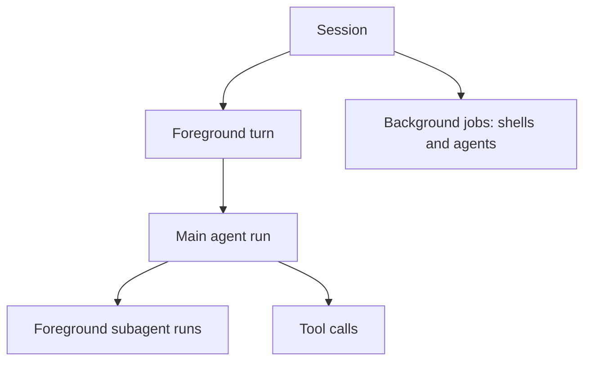

# Interaction features

How you work with the agent while it runs, and how you extend it: steering,
interrupt and cancel; plan mode, structured questions and todos; hooks;
slash commands, custom commands and skills. The round loop these features
plug into is in [Core features](features-core.md). Each section goes from
plain words to developer detail; see
[How to read these pages](README.md#how-to-read-these-pages).

## Steering, interrupt and cancel

**In plain words**

Think of a driver: *steering* is "take the next left" (done at the next
junction), *interrupt* is "stop, listen to me now", and *cancel* is "we're
done, park here".

**How it works**

- **Steer** (Enter while the agent works): the message is queued as a pill
  and delivered at the next round boundary, inside the message that carries
  the tool results. If the model is just finishing, a waiting message keeps
  the turn going. You can edit or remove queued messages until then.
- **Interrupt** (⌘Enter or Ctrl+Enter, or the **⌘Enter interrupts** hint
  under the composer): the running turn stops and your message goes out at
  once as a new turn, which is told the previous one was interrupted.
- **Cancel** (Esc or the stop button): the turn and its foreground
  subagents end; unfinished calls get "cancelled by user" results after a
  short grace period for tools to stop their processes. Background jobs
  keep running, and queued messages go out with your next prompt.

The app stays responsive because the session actor never waits for the
model or a tool: approvals, questions and plan reviews wait in a separate
*broker*. Cancellation follows a tree, so cancel and interrupt cut only the
turn's branch:



**For developers**

- Commands `steer`, `interrupt { text }`, `cancel` and `editQueue { queued }`
  (replaces the whole queue); `submit` during a turn is queued as steering.
  Event `queueChanged`.
- [session/control.rs](../../crates/z-engine-engine/src/session/control.rs)
  handles the quick commands (approvals, questions, plans, mode, model,
  effort, the queue, job kills); [run/reminders.rs](../../crates/z-engine-engine/src/run/reminders.rs)
  hands queued steering to the main agent; `run/stop.rs` lets steering
  continue a run; `session/prompt.rs` carries leftover steering and the
  interruption reminder into the next turn.
- Prompt commands such as `/review` can't be queued: "/name waits for an
  idle session".

## Plan mode, structured questions and todos

**In plain words**

Plan mode is "measure twice, cut once": the agent may look but not touch
until you approve a written plan. A structured question is a short
multiple-choice form for decisions that are yours. Todos are the agent's
visible checklist.

**How it works**

- **Plan mode:**
  1. The policy refuses anything that changes state ("plan mode is
     read-only; use ExitPlanMode to propose the plan"). Reading, searching,
     read-only commands, the language server, the web and `explore` or
     `plan` subagents still work.
  2. The model calls `ExitPlanMode`; a **Plan ready for review** card
     appears and the agent waits.
  3. **Approve** switches to Auto-accept edits or Ask (your choice) and the
     agent implements the plan, or your edited version. **Keep planning**
     sends your feedback, and the agent revises in plan mode.
  4. Only the main agent proposes plans; the `plan` subagent reports its
     plan to the main agent instead.
- **Questions:** `AskUserQuestion` carries one to four multiple-choice
  questions (one or several answers, or your own text). The agent waits;
  **Dismiss** tells it not to ask again and to use its best judgment.
  Subagents can't ask.
- **Todos:** `TodoWrite` replaces the whole list each time; items are
  pending, in progress or completed, one in progress at a time. The list
  survives compaction, and an agent working on a multi-step task for a
  while without one is reminded to create it.
- While a card waits you can still queue messages, change mode or cancel.
  Another chat waiting on a card is counted beside the island, and the
  Inbox lists its card.

**For developers**

- Tools [exit_plan_mode.rs](../../crates/z-engine-tools/src/builtin/exit_plan_mode.rs),
  [ask_user_question.rs](../../crates/z-engine-tools/src/builtin/ask_user_question.rs)
  and [todo_write.rs](../../crates/z-engine-tools/src/builtin/todo_write.rs)
  are not concurrency-safe, so each runs alone in its batch.
- They reach the engine through `InteractionPort`
  ([tools side](../../crates/z-engine-tools/src/ports/interaction.rs),
  [engine side](../../crates/z-engine-engine/src/ports/interaction.rs)),
  which waits on the [broker](../../crates/z-engine-engine/src/broker/exchange.rs);
  `reviews.rs` persists questions and plan reviews, and in `pending.rs` an
  entry removed without a reply resolves as denied or dismissed.
- Protocol ([interaction.rs](../../crates/z-engine-protocol/src/interaction.rs),
  Claude Code field names): `PlanDecision::Approve { mode, edited_plan }`
  or `Revise { feedback }`; commands `resolvePlan`, `answerQuestion` (no
  answers means dismissed); events `planProposed`, `planResolved`,
  `questionAsked`, `questionResolved`, `todosUpdated`.
- The todo reminder is `TodoNudge` in `run/reminders.rs`.

## Hooks

**In plain words**

Hooks are your own scripts that Z Engine calls at fixed moments, like a
doorbell wired to your own alarm: "before any shell command runs, ask my
script first".

**How it works**

A [hook](glossary.md#hook) is set in any settings file or in
**Settings → Hooks**:

```toml
[[hooks.PreToolUse]]
matcher = "Bash"                      # regex over the whole tool name
command = "./scripts/check-command.sh"
timeout_secs = 60                     # the default
```

| Event | Fires | Can block? |
|---|---|---|
| `SessionStart` | A chat opens (`startup` or `resume`) | No; output becomes context |
| `UserPromptSubmit` | Before your prompt goes to the model | Yes; output becomes context |
| `PreToolUse` | In the gate, before the permission decision | Yes; can also force allow, ask or deny, or rewrite the input |
| `PostToolUse` | After a tool finishes | No; feedback is added to the result |
| `Stop`, `SubagentStop` | The main agent or a subagent stops | Yes; the agent keeps working (at most 5 times per turn) |
| `PreCompact` | Before older history is summarized | No |
| `Notification` | Z Engine is waiting for you | No |
| `SessionEnd` | A chat closes | No |

- `matcher` must match the whole target: the tool name for `PreToolUse`
  and `PostToolUse`, the start source (`startup` or `resume`) for
  `SessionStart`, the trigger (`auto` or `manual`) for `PreCompact`. Empty
  or `*` matches everything; other events run every hook. **Settings →
  Hooks** shows the field for those four events.
- The hook gets JSON on standard input: `session_id`, `transcript_path`,
  `cwd`, `hook_event_name` and fields such as `tool_name`, `tool_input`,
  `tool_response`, `prompt` or `stop_hook_active`.
- Exit code 0 continues (plain output becomes context where the table says
  so; JSON output may decide), 2 blocks with standard error as the reason,
  anything else shows a warning.
- User hooks run first, then project, then personal project, in the order
  written. The first block ends the chain; a rewritten input is what later
  hooks and the policy see.
- A hook can make a decision stricter or approve something that would ask,
  but it can never lift a deny rule or plan mode.
- Hooks run with your account's rights, outside the sandbox, without
  approval cards. Hooks defined by a project run only after you
  [trust the workspace](glossary.md#workspace-trust).

**For developers**

- Event names: `HOOK_EVENTS` in [settings/hooks.rs](../../crates/z-engine-config/src/settings/hooks.rs).
- [hooks/](../../crates/z-engine-engine/src/hooks/mod.rs): `event.rs`
  (payloads with Claude Code field names), `runner.rs` (order, `hookRan`
  events, first block ends the chain), `outcome.rs` (exit codes and JSON),
  `notify.rs` (`Notification`).
- Call sites: `PreToolUse` in [batch/gate.rs](../../crates/z-engine-engine/src/batch/gate.rs),
  whose `with_override` never lifts a denial; `PostToolUse` in
  `batch/call.rs`; `Stop` and `SubagentStop` in `run/stop.rs`;
  `UserPromptSubmit` in `session/turn.rs`.
- To add an event, follow the "a hook event" row in [AGENTS.md](../../AGENTS.md#how-to-add-things-follow-exactly)
  and the [architecture](../architecture/v2-engine.md#hooks).

## Slash commands, custom commands and skills

**In plain words**

[Slash commands](glossary.md#slash-command) are shortcuts. Some are
answered at once, like asking a waiter for the bill; others hand the agent
a ready-made request, like ordering "the usual".
[Skills](glossary.md#skill) are recipe cards the agent keeps in a drawer
and takes out only when a task needs one.

**How it works**

`/name args` is looked up in one catalog; the first match wins:

1. **Engine built-ins**, answered without the model: `/compact`,
   `/context`, `/cost`, `/status`, `/remember`, `/model`, `/mode`,
   `/effort`, `/mcp`, `/todos`, `/doctor`, `/add-dir`.
2. **Your custom commands**: markdown files in `.z-engine/commands/` or
   `.claude/commands/`, project first, then your user folder. They may
   replace a prompt built-in, never an engine built-in.
3. **Prompt built-ins**: `/init`, `/review`, `/security-review`, `/commit`.
4. **MCP prompts** of running servers, as `/mcp__<server>__<prompt>`.

An unknown name gets a notice with close matches. App commands (`/help`,
`/agents`, `/export`, `/clear` and others) are handled by the window and
never reach the engine; `/context` opens the context card when the chat is
open and otherwise goes to the engine built-in.

- Commands 2 to 4 start a turn. The transcript shows `/name args`; the
  model also gets the body, after `$ARGUMENTS` and `$1`..`$9` are filled
  in, `@path` inlines files the agent may read (256 KiB each, 1 MiB in
  total) and `` !`cmd` `` runs in the project root if your rules already
  allow it.
- Frontmatter `allowed-tools` become rules for that turn only; `model`
  picks that turn's model. `@agent-<name>` in a message reminds the model
  to use that subagent.
- **Skills** live in `skills/<name>/SKILL.md` under `.z-engine/` or
  `.claude/`, in the project or your user folder. Only names and
  descriptions are in the system prompt; when a request matches, the model
  calls `Skill`, which returns the full instructions and the skill's
  folder. Skills load without asking; a `Skill(<name>)` deny rule blocks
  one.

**For developers**

- [commands/catalog.rs](../../crates/z-engine-engine/src/commands/catalog.rs)
  orders the sources; its neighbours `args.rs`, `expand.rs`, `include.rs`,
  `inline.rs`, `mentions.rs`, `mcp_prompt.rs` and `suggest.rs` fill in and
  check templates.
- [session/slash.rs](../../crates/z-engine-engine/src/session/slash.rs)
  dispatches; [session/command_turn.rs](../../crates/z-engine-engine/src/session/command_turn.rs)
  runs a prompt command's turn with grants from `session/grants.rs`. The
  model sees two text blocks: the visible `/name args`, then the body in
  `<command name="name">…</command>`.
- Prompt built-ins: [prompts/commands/](../../crates/z-engine-prompts/prompts/commands/)
  plus `BUILTIN` in [commands.rs](../../crates/z-engine-prompts/src/commands.rs);
  app commands: [uiCommands.ts](../../crates/z-engine-gui/ui/src/lib/stores/uiCommands.ts).
- Discovery: [extensions/discover.rs](../../crates/z-engine-config/src/extensions/discover.rs)
  with `command.rs` and `skill.rs` (project files resolving outside the
  project are skipped). At run time, `SkillPort` in
  [ports/skills.rs](../../crates/z-engine-engine/src/ports/skills.rs), the
  [Skill tool](../../crates/z-engine-tools/src/builtin/skill.rs) and the
  skills section of the [system prompt](../../crates/z-engine-context/src/system.rs).
- Protocol: command `runCommand { name, args }`; event
  `commandOutput { name, markdown }` for informational built-ins.

See also: [How Z Engine works](README.md) ·
[Core features](features-core.md) ·
[Agents and context](features-agents-and-context.md) ·
[Glossary](glossary.md) · [User guide](../user-guide/README.md)
